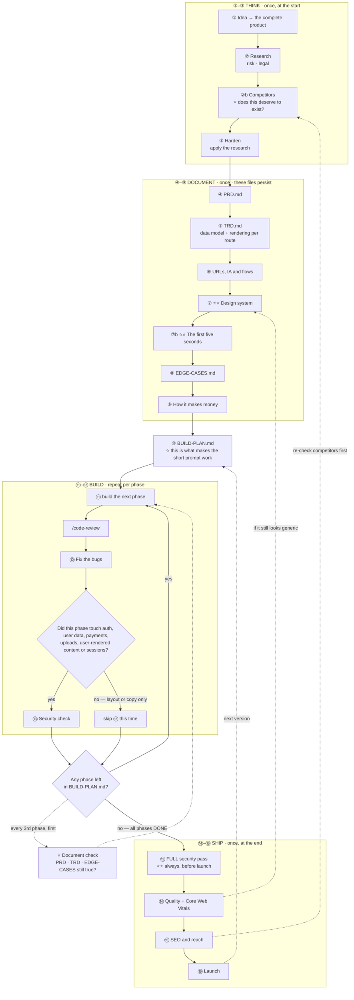

# 🌐 Web Development — My Prompt Library

> ⭐⭐ **These are written to be pasted as-is.** No blanks to fill. Each one reads the session
> and the repo and works out its own context — so the same prompt works on any web app, at any stage.

**How I actually work, and where each prompt lands:**

```
  THINK      ① idea → the complete product
             ② research: risk + legal
             ②b ⭐⭐ competitors — does this deserve to exist?
             ③ harden — update it to be safer

  DOCUMENT   ④ PRD          ⑤ TRD
             ⑥ information architecture, URLs + user flows
             ⑦ ⭐⭐ DESIGN SYSTEM — the heavyweight step on web
             ⑦b ⭐⭐ THE FIRST FIVE SECONDS — the landing moment
             ⑧ edge cases   ⑨ how it makes money

  BUILD      ⑩ ⭐⭐ THE BUILD PLAN — this is what makes ⑪ work
             ⑪ ⭐⭐ "build the next phase" ← repeat until done
             ⑫ /code-review → fix the bugs
             ⑬ security check

  SHIP       ⑭ quality + Core Web Vitals
             ⑮ SEO and how it reaches real users
             ⑯ launch
```

---

# ⭐⭐ Web is not mobile — five things that invert

> **Same 16 steps as the app library, different physics.** If you have used that one, read this
> box and the rest will make sense.

```
 ① ⭐⭐ YOU CAN HOTFIX. A deploy is three minutes, not a three-day review.
    ⇒ ⭐ SO SHIP SMALLER AND MORE OFTEN. The mobile discipline of
      "get it perfect before submitting" is the wrong instinct here.
    ⇒ ⭐⭐ BUT NOT EVERYONE GETS THE FIX: someone has a tab open from
      Tuesday, a CDN is serving a cached asset, a service worker is
      handing out last week's JavaScript. "Deployed" ≠ "everyone has it".

 ② ⭐⭐ THERE IS NO STORE, AND NO INSTALL.
    No review, no rejection, no IAP rule — use Stripe freely.
    ⇒ ⭐⭐ BUT THERE IS ALSO NO COMMITMENT. Nobody downloaded anything.
      THEY BOUNCE IN THREE SECONDS AND NEVER COME BACK, and you will
      never know why. This is why the frontend carries more weight
      here than it does in an app.

 ③ ⭐⭐ SEO IS A FIRST-CLASS CONCERN, NOT A LAUNCH TASK.
    It is decided by your URL structure, your rendering strategy and
    your Core Web Vitals — all architecture, all chosen in ⑤ and ⑥.
    ⇒ ⭐ Retrofitting SEO means changing URLs, and changing URLs
      throws away everything you earned.

 ④ ⭐⭐ THE BROWSER IS HOSTILE IN ITS OWN WAY.
    The back button · refresh mid-action · three tabs of your app at
    once · an ad blocker eating your analytics · an extension mangling
    the DOM · a 4-year-old Android Chrome · someone at 320px wide and
    someone at 3440px.

 ⑤ ⭐⭐ PERFORMANCE IS REVENUE AND RANKING, MEASURED IN PUBLIC.
    Core Web Vitals are a ranking signal AND a conversion factor, and
    anyone can measure yours. On mobile a slow app gets a bad review;
    on web a slow site gets fewer visitors in the first place.
```

**Everything else — the ownership question, the build plan, the gates, the loop — is the same.**

---

# ⭐ Which track — pick before you start

| | **FULL** | **SHORT** |
|---|---|---|
| **When** | A real product. Real users' data. Something you will maintain. | A landing page, a prototype, an internal tool, testing an idea |
| **Think** | ① ② ②b ③ | ① + ⭐ ②b |
| **Document** | ④ ⑤ ⑥ ⑦ ⑦b ⑧ ⑨ | ④ **short** PRD + ⑤ the data model half + ⑦ + ⑧ |
| **Build** | ⑩ then ⑪–⑬ per phase | ⑩ then ⑪–⑫ per phase |
| **Ship** | ⑭ ⑮ ⑯ | ⑭ + ⑯ |
| **Sessions before code** | ≈ 10–12 | ≈ 3–4 |

```
⭐⭐ THE THREE YOU NEVER SKIP, ON EITHER TRACK:

  ⑩ THE BUILD PLAN — or your five words have nothing to read.

  ⑤'s OWNERSHIP QUESTION — "who owns this record and which field
    proves it?" An hour now; a rewrite of every query later.

  ⭐⭐ ⑦ THE DESIGN SYSTEM — on web this is not polish. It is the
    first thing every visitor judges, before they read a word.
```

---

## ⭐⭐ Read this once — why "build the next phase" works

```
⭐⭐ FIVE WORDS ONLY WORK IF THE AGENT CAN FIND ITS OWN PLACE.
   That is not a prompt problem. It is a FILE problem.

  PROMPT ⑩ writes BUILD-PLAN.md — numbered phases, each with a
  definition of done and a status marker.

  ⇒ ⭐ THEN "build the next phase" IS SELF-LOCATING. The agent reads
    the plan, finds the first phase not marked DONE, and knows what
    it is building and when to stop.

  ⇒ ⭐⭐ WITHOUT THAT FILE, THE SAME FIVE WORDS PRODUCE A DIFFERENT
    APP EVERY SESSION — and you will not notice for three weeks.

⭐ SO: DO ⑩ ONCE, PROPERLY. It is the highest-leverage step here.
```

**Also do this once per project** — put `CLAUDE.md` at the repo root so every session reads
your rules without you pasting them: [CLAUDE-md-template.md](CLAUDE-md-template.md)

---

# ⭐⭐ These prompts adapt — that is the point

> **A prompt that dictates the answer gets you the prompt's opinion, not the model's.**
> Every step gives the model a **floor and a set of questions**, never a fixed answer.

```
⭐⭐ WHERE EACH PROMPT DELIBERATELY REFUSES TO DECIDE FOR YOU:

  RENDERING    ⑤ does not assume SSR. Static, server-rendered, client,
               streamed, or a mix per route — it must CHOOSE per route
               and say why, because that choice IS your SEO and your
               performance.

  DATA MODEL   ⑤ does not assume tables. It names the ownership
               mechanism your stack actually uses.

  DESIGN       ⑦ has no house style. It derives a direction from your
               product and your audience — a fintech dashboard and a
               children's reading app should share nothing.

  SECURITY     ⑬ starts with THIS app's threat model. My categories
               are a floor; it must add yours.

  EDGE CASES   ⑧ the categories it ADDS are the valuable part.

  PHASES       ⑩ has no fixed count.
```

**Three lines you can add to any prompt here when you want more range:**

```
① "Before answering, tell me what is unusual about THIS product
   compared to a typical one — then let that change your answer."

② "Where my prompt assumes something that does not fit, say so and
   answer the better question instead."

③ "Give me the option I have not considered, even if you do not
   recommend it."
```

---

# ① The idea → the complete product

⚙️ **Strongest model · `think hard`** — every later step inherits this one. A shallow answer here costs weeks.

```
I have a web app idea. I want you to develop it into a complete product
with me — you know more about what web products need than I have
written down, so fill the gaps rather than waiting for me to specify
everything.

MY IDEA:
<describe it however roughly — one line is fine>

Work through this with me:

1. WHAT I ACTUALLY MEAN
   Restate my idea as you understand it. If it is ambiguous, give me
   the two or three different products it could become and ask which
   one I mean. Do not silently pick one.

2. THE COMPLETE FEATURE SET
   Everything this needs to actually work for a real user — not just
   what I mentioned. Group as:
   · CORE — without these it is not the product
   · EXPECTED — users will assume these exist and be annoyed if not
     (auth, search, settings, export, sharing, email notifications...)
   · DIFFERENTIATING — the reason someone picks this over the
     alternative
   · LATER — real ideas, deliberately deferred

3. THE ONE CORE LOOP
   The single action a user repeats. If there is no repeated action,
   say so plainly — that is usually a fatal problem, not a detail.

4. ⭐ WHO IS THIS FOR, AND WHAT DO THEY SEE FIRST?
   Web has no install step. Someone arrives cold from a link or a
   search result. What is on that first screen, and what makes them
   stay past three seconds?

5. EVERY PAGE
   The full list with one line each on what it is for.
   ⭐ Mark which ones must be PUBLIC (indexable, shareable, no login)
   and which are behind auth. That split shapes the whole architecture.

6. WHAT I HAVE NOT THOUGHT ABOUT
   The parts that are harder than they look. Usually: auth edge cases,
   email deliverability, file uploads, search, real-time, permissions,
   or someone else's API.

7. THE THREE DECISIONS I MUST MAKE NOW
   The ones expensive to reverse. Give me the options and your
   recommendation, not just the question.

DO NOT ask me one question at a time — batch everything you need.
DO NOT flatter the idea. If it has a fundamental problem, lead with
that. Mark your assumptions as assumptions so I can correct them.
```

```
⭐ THE GATE — you can say the core loop in one sentence, and you know
   which pages are public and which are behind auth.
```

⭐ **Cross-check the page list against**
[Reference/Page-Inventory.md](Reference/Page-Inventory.md) — every page a complete web app has.
Most half-finished products are not missing features, they are missing **a whole surface nobody
wrote down** (the auth surface alone is eight pages, not one).

---

# ② Research — risk and legal

⚙️ **Strongest model · `think hard` · web search ON** — regulations must be real and current, not recalled. ⭐ Competitors are the next step, ②b.

```
Research this product properly before we design it. Use what we defined
in this session.

I want three things. ⭐ Competitors are ②b — do not cover them here.

1. ⭐ THE RISK REGISTER
   · TECHNICAL — what is genuinely hard to build correctly
   · DEPENDENCY — whose API, platform or pricing can kill this
   · OPERATIONAL — what breaks when it WORKS: support load, abuse,
     moderation, cost at scale, someone scraping you
   · ADOPTION — why people will visit once and never return
   Rank by (likelihood × damage) and say which ones change the design.

2. ⭐⭐ THE LEGAL AND COMPLIANCE PICTURE — specific to what this does:
   · What personal data does it touch, and what does that trigger?
     (GDPR / DPDP / CCPA — say which apply and why)
   · ⭐ COOKIES AND TRACKING: what needs consent, what does not, and
     what a compliant banner actually has to do. Analytics that sets
     a cookie is not the same as analytics that does not.
   · Data retention, export, and deletion — a real deletion path
   · Age: does this need age gating? Does it touch children's data?
   · If users can post content: moderation duties, takedown process,
     and what you are liable for
   · If it takes money: refunds, subscription disclosure, auto-renew
     terms, and tax/VAT on digital goods sold across borders
   · Accessibility: ⭐ web accessibility is legally actionable in
     several jurisdictions. Say which standard applies here (WCAG
     level) and treat it as a requirement, not a nice-to-have.
   · Licences of anything we depend on — AGPL is a trap
   · Terms of service and privacy policy — what must be in them

3. ⭐ WHAT COULD GET THIS TAKEN DOWN OR BLOCKED
   Payment processor rules, hosting AUP, a DMCA path if users upload,
   anything that looks like a category a provider refuses.

For each finding: what it is · why it applies HERE · what it forces us
to do differently.

DO NOT give me a generic compliance overview. If something does not
apply, say so and why. Where a rule depends on jurisdiction or on
facts I have not given you, say what you need to know.

I am not a lawyer and neither are you. Mark clearly which items are
"get advice on this" versus "this is standard practice".
```

```
⭐⭐ THE GATE — you know the top three risks, and at least one of them
   has changed something about the product. Then go to ②b.
```

---

# ②b ⭐⭐ Competitor analysis — does this deserve to exist?

⚙️ **Strongest model · `think hard` · ⭐⭐ web search ON** — every name, price and review must be real. This step is worthless from memory.

```
Research the competition properly. Use the product we defined in this
session. ⭐ Everything here must come from actually looking — real
names, real prices, real complaints. If you cannot verify something,
say so rather than filling the gap with something plausible.

1. WHO THEY ACTUALLY ARE — three to five of them
   For each: what it does · what it charges and on what model · roughly
   how big · how long it has existed.
   ⭐ INCLUDE THE NON-OBVIOUS COMPETITOR: a spreadsheet, a Notion
   template, an agency, a WhatsApp group, or doing nothing at all.
   Those beat most products and never appear on a competitor list.

2. ⭐⭐ MINE THE REAL COMPLAINTS — the highest-signal source there is
   On web there is no app store, so look where people actually
   complain: G2 and Capterra mid-range reviews (3-star, not 1 or 5),
   Reddit threads, "alternative to X" posts, their own support forum,
   X/Twitter replies to their announcements.
   ⭐⭐ THE MID-RANGE REVIEW IS THE GOLD: someone who pays, stays, and
     is frustrated. That is your wedge in their own words.
   Quote the actual complaints. Group into themes, rank by frequency.

3. ⭐⭐ FOR EACH TOP COMPLAINT: WHY HAS IT NOT BEEN FIXED?
   The most important question here. They know. They did not fix it:
   · DELIBERATE — fixing it breaks their pricing or their model
   · SEGMENT — they serve someone else; this complainer is not their
     customer
   · HARD — genuinely difficult, and it will be just as hard for me
   · MISSED — nobody got to it. ⭐ Rarest, and the only one that is
     straightforwardly good news.
   ⇒ ⭐ IF YOU CANNOT TELL, SAY SO. A guess is worse than a gap.

4. ⭐ HOW THEY GET TRAFFIC
   This matters more on web than anywhere. What ranks for them, what
   content they publish, whether they buy ads, whether they grew from
   a community or a launch or an integration marketplace.
   ⇒ ⭐⭐ IF THEY ALL RANK FOR THE SAME QUERIES, that tells you both the
     demand and how expensive the front door is.

5. ⭐ WHO TRIED THIS AND DIED
   Dead products, abandoned repos, shut-down startups, and the visible
   reason. ⇒ ⭐⭐ A GRAVEYARD TEACHES MORE THAN A LEADERBOARD.

6. ⭐⭐ THE PARITY TRAP
   What will users expect on day one JUST BECAUSE every competitor has
   it? List them — then tell me which I can refuse to build and still
   survive. This is the difference between a v1 that ships and one
   that never does.

7. ⭐ HOW GOOD DO I HAVE TO LOOK?
   Screenshot-level honesty: are these products beautiful, competent,
   or ugly? On web, design is a competitive dimension because
   switching cost is one click. Tell me the bar.

8. THE HONEST VERDICT
   Is there a real gap, or does it only look like one from outside?
   ⭐ If this space is well served and my angle is thin, LEAD WITH THAT.

DO NOT give me a feature comparison table. I need to know what people
are unhappy about, why nobody has fixed it, and whether I actually can.
```

```
⭐⭐ THE GATE — you can name ONE complaint that appears across multiple
   competitors, and say why it has not been fixed.
   ⇒ That sentence is your product's reason to exist.
     If you cannot write it, you do not have one yet.
```

---

# ③ Harden — update it to be safer

⚙️ **Strongest model · `think hard`** — judgement about trade-offs, which is where reasoning depth pays.

**The step that closes the loop.** Research is worthless if the design does not change.

```
Take everything from ② and ②b and update the product design so the
risks are actually handled. Do not summarise the research again —
CHANGE the design and show me the diff in decisions.

1. WHAT CHANGES IN THE FEATURE SET
   Which features get modified, restricted, delayed or dropped because
   of a risk, a legal finding, or something a competitor taught us.
   For each: what it was, what it is now, and which finding forced it.

2. WHAT WE MUST NOW BUILD THAT WE HAD NOT PLANNED
   A cookie consent flow, an account-deletion path, a data export,
   moderation tooling, an audit trail, a "report" button, an
   accessibility commitment, a status page.
   ⭐ These are features. They take time. Put them on the list properly
   rather than leaving them implied.

3. THE DATA MINIMISATION PASS
   Field by field: do we actually need this? What we do not store
   cannot leak, cannot be subpoenaed, does not need consent, and does
   not appear on a privacy policy.

4. ⭐⭐ WHERE EACH RULE IS ENFORCED
   For every rule that matters, say explicitly whether it is enforced
   in the BROWSER or on the SERVER.
   ⭐ Anything a user could change with devtools belongs on the server.
     A disabled button is not a permission. A hidden route is not
     authorization. If we put something in the client, move it and
     say so.

5. THE THINGS WE ARE ACCEPTING
   Risks we choose to live with for v1. Name them. A written-down
   accepted risk is a decision; an unwritten one is an accident
   waiting to be discovered.

DO NOT weaken the product to eliminate every risk. Tell me where the
safe option costs too much and the honest trade is to accept it.
```

```
⭐ THE GATE — the feature list is different from the one in step ①.
   If nothing changed, the research was not applied.
```

---

# ④ PRD — the product document

⚙️ **Strongest model · standard** — mostly writing down decisions already made. Completeness matters more than depth.

```
Write PRD.md from everything in this session.

This is the permanent product reference. Every future session reads it
before touching code, so it must stand completely alone — assume the
reader has no memory of this conversation.

1. WHAT THIS IS — three sentences. Someone reading only this knows
   what it does and who it is for.
2. THE USER — who they are, the moment of need, what they do today.
3. THE CORE LOOP — the repeated action, step by step.
4. FEATURES — each with: what it does · what "done" means · what it
   explicitly does NOT do.
5. NOT IN V1 — with the reason each one waits.
6. ⭐ PAGES — every page, its purpose, whether it is PUBLIC or behind
   auth, and what it shows with no data.
7. ⭐⭐ THE RULES OF THE DOMAIN — the business logic that is not
   obvious. What is the maximum · what happens on a conflict · who can
   see what · what is irreversible · what must never happen twice.
   This section prevents more rework than all the others combined.
8. COMPLIANCE REQUIREMENTS — from ②, written as product requirements
   rather than legal notes.
9. VOCABULARY — the exact words this product uses, and the words it
   must never use. Pick one and never drift.
10. OPEN QUESTIONS — what is genuinely undecided. Do not paper over
    these with a guess.

DO NOT include implementation, frameworks, or code. What and why,
never how.
```

```
⭐⭐ THE GATE — paste PRD.md into a brand-new chat with nothing else and
   ask "what is this and who is it for?" If the answer is right, it
   works. Fix it now, not after 40 files exist.
```

---

# ⑤ TRD — the technical document

⚙️ **Strongest model · `ultrathink` · ⭐⭐ PLAN MODE** — the most expensive step to get wrong. Everything is built on it, and on web the rendering choice is also your SEO.

```
Write TRD.md — how we build what PRD.md describes. Read the PRD first
and trace every technical choice back to a product requirement.

My defaults: Next.js App Router + TypeScript · shadcn/ui · Supabase ·
Clerk · Stripe · Upstash Redis · Sentry · Vercel · Cloudflare.
⭐ Argue against any of them if this product is a bad fit.

1. THE STACK — each choice with the reason and what it costs at 1,000
   and 10,000 users.

2. ⭐⭐ THE RENDERING STRATEGY, PER ROUTE — this IS your SEO
   For every page: static, server-rendered, client-rendered, streamed,
   or incrementally regenerated? And WHY.
   ⭐ A public marketing page and a logged-in dashboard have opposite
     answers, and getting this wrong is either invisible-to-Google or
     needlessly slow.
   ⇒ State the caching strategy alongside it: what is cached, where
     (browser, CDN, server), for how long, and HOW IT IS INVALIDATED.
     ⭐⭐ Cache invalidation is where the subtle bugs live — be explicit.

3. ⭐⭐ THE TRUST BOUNDARY
   What runs in the browser, what runs on the server, and what the
   browser must NEVER decide: prices, limits, roles, permissions,
   anything a user could edit in devtools.
   ⭐ Say explicitly which environment variables are public
     (NEXT_PUBLIC_*) and confirm nothing secret is among them.

4. THE DATA MODEL — ⭐ CHOOSE THE SHAPE, THEN JUSTIFY IT
   Relational is my default, but if a document store, a search index,
   an event log or something else genuinely fits better, design THAT
   and say why.
   Whatever the shape:
   · every entity with fields, types, and what may be empty
   · ⭐⭐ OWNERSHIP: for each entity, who owns this record and which
     field proves it? Anything you cannot answer is a leak waiting to
     happen — flag it rather than guessing.
   · ⭐ HOW OWNERSHIP IS ENFORCED IN THIS STORE — row-level security,
     database rules, API middleware. Name the mechanism and write the
     rules NOW.
   · what happens on delete, for every relationship
   · exact types for anything a human counts — money and time must
     never be floats or naive strings
   · the queries this will actually run, and what makes each fast
   · ⭐ a STABLE sort for every paginated list — ties with no
     tiebreaker duplicate rows across pages

5. THE API — every endpoint or server action with method, path, auth
   requirement, request shape and response shape. Explicit shapes,
   never whole rows.

6. ⭐ SESSIONS AND AUTH
   Where the session lives, cookie flags (HttpOnly, Secure, SameSite),
   how it refreshes, what happens when it expires mid-action, and how
   logout works across multiple open tabs.

7. THIRD PARTIES — each with: why · cost · what happens when it is
   down · and what it costs you in page weight if it ships to the
   browser.

8. ⭐ THE STALE-CLIENT PROBLEM
   Someone has had a tab open since Tuesday. Their JavaScript is old,
   their session may be dead, and they are about to submit a form.
   What happens? ⇒ Say how the app detects a new deploy and what it
   does about it.

9. ⭐ THE FIVE DECISIONS THAT ARE EXPENSIVE TO REVERSE — named, with
   what each forecloses. ⭐⭐ URL structure is almost always one of
   them: change URLs later and you throw away every link and every
   ranking you earned.

10. WHAT BREAKS AT 10x — the specific first thing, not "we'll scale
    later". ⭐ Usually a missing index or an N+1, not architecture.

DO NOT produce a generic best-practice architecture. Every choice
traces to the PRD. Where you are guessing, say so. Where two options
are close, give me the tiebreaker instead of pretending one is obvious.
```

```
⭐ THE GATE — every entity has an owner you can name, the enforcement
   rule is WRITTEN, and every route has a deliberate rendering choice.
```

---

# ⑥ Information architecture, URLs and flows

⚙️ **Strongest model · `think hard`** — URLs are close to permanent once indexed and linked.

```
Map how this product is organised and how people move through it.
Three parts — do all three, they catch different problems.

PART 1 — ⭐⭐ THE URL STRUCTURE
· Every route, written out.
· ⭐ Readable, stable, and meaningful. /invoices/2024-03 not /p?id=8812.
· What is PUBLIC and indexable vs behind auth.
· Where pagination, filters and sorting live — query params or path,
  and which of those should be indexable.
· ⭐⭐ WHAT HAPPENS WHEN SOMETHING IS RENAMED OR DELETED: a permanent
  redirect, a 410, or a 404? Decide the rule now.
· Trailing slashes, casing, and the canonical form of every URL.

⭐ Treat this as near-permanent. Changing URLs later throws away every
  inbound link and every ranking.

PART 2 — THE NAVIGATION AND HIERARCHY
· What is in the primary nav, and what is deliberately not.
· How deep can a user get, and can they always tell where they are.
· ⭐ THE MOBILE NAV: what the menu becomes under ~768px. This is where
  most sites quietly break.
· What "back" does after a modal, a filter change, and a form submit.
· Empty search, no results, and no permission — where do those land?

PART 3 — THE USER FLOWS
For the three most important journeys — starting with someone arriving
COLD from a link or a search result — walk it step by step:
· what they see · what they must decide · what could confuse them ·
  where they could fail · what happens when they do
· ⭐⭐ Count the clicks from landing to the core action completed.
  Fewer is usually better — if it is more than about three, say what
  to cut or why this product genuinely needs them.
· ⭐ Where do we ask them to sign up, and have they felt any value yet?
  Asking too early is the single most common conversion killer.

THEN TELL ME:
· Which page is doing too much and should be two
· Which two pages are so similar they should be one
· Any dead end: a page with no forward action
· ⭐ Every place a user could arrive by DEEP LINK without context —
  can they orient themselves from a cold landing on that URL?

DO NOT draw the happy path only. The interesting parts are where it
breaks.
```

```
⭐ THE GATE — you can write the full URL list, and you know what
   happens to a URL when the thing behind it is deleted.
```

---

# ⑦ ⭐⭐ Design system — the heavyweight step on web

⚙️ **Strongest model · `think hard`** · ⭐ give it reference URLs of sites you admire — taste is transmitted by example, not adjectives.

> ⭐⭐ **On web, design is not polish — it is the first argument your product makes.** Nobody
> installed anything. They arrived from a link, they are judging you against a competitor one
> tab away, and they will leave in three seconds. **This step gets more effort than it would
> on mobile.**

```
Design the visual system for this product. My goal is that it looks
DELIBERATE and specific — not like a generated template.

⭐ FIRST, BEFORE ANY TOKENS: WHAT SHOULD THIS FEEL LIKE?
   Derive the direction from the product and the audience, not from a
   house style. A fintech dashboard, a children's reading app, a
   developer tool and a wedding planner should share NOTHING visually.
   Give me three adjectives and defend each one from something in the
   PRD. If my references contradict my product, say so.

   REFERENCES I LIKE: <paste 2-3 URLs, or say "none, propose some">
   ⭐ If I gave references, tell me what specifically works in them —
     the structure, the restraint, the type, the density — not "it
     looks clean". If I gave none, propose three real sites and say
     what each would give us.

1. ⭐⭐ THE ANTI-GENERIC AUDIT — what we will NOT do
   These are the tells that make a site read as machine-made. Name any
   that are creeping in, and give me the alternative:
   · a purple-to-blue gradient anywhere
   · glassmorphism / frosted cards
   · three feature cards in a row with emoji icons
   · everything centred in a 1200px column
   · "Empower your workflow" / "Seamlessly integrate" / "Supercharge"
   · a testimonial from a person who does not exist
   · a hero illustration from a generator
   · bold weight everywhere instead of real hierarchy
   · animation on every element
   ⇒ ⭐⭐ THESE ARE NOT UGLY. THEY ARE ANONYMOUS. They read as "nobody
     decided anything," and visitors feel it even if they cannot name it.

2. THE TOKENS — before any component
   ⭐ The numbers below are a sane default, not a law. If this product's
   density or audience calls for something different, say so and
   propose what fits.
   · ONE spacing scale, nothing outside it. ⭐⭐ Inconsistent padding is
     the thing nobody consciously notices and everybody feels as
     "cheap".
   · A small set of type sizes and two weights. Real hierarchy.
   · ⭐ ONE REAL TYPEFACE, chosen deliberately. The default system
     stack is itself a tell. Say what it costs in page weight.
   · Colours named by ROLE, never by value: --fg, --fg-muted, --bg,
     --bg-subtle, --border, --primary, --danger.
     ⭐ ONE accent, on the primary action only.
   · One radius. One border weight. One shadow, if any.
   · ⭐ Dark mode: decide NOW whether we support it. Role-named tokens
     make it a second block; value-named colours make it a rewrite.

3. THE COMPONENT SET — build on shadcn/ui, and OWN the code
   ⭐ shadcn copies components into the repo, so I can edit them. Take
   the ones that are genuinely hard — Dialog, Dropdown, Combobox,
   Popover, Sheet, Toast, Tooltip — because those solve focus trapping
   and keyboard behaviour, which is the part hand-rolling gets wrong.
   ⭐⭐ CHANGE THE DEFAULT THEME IMMEDIATELY. Shipping shadcn defaults
     untouched is its own tell.
   Keep the set small. Eight components plus three layout primitives
   is a design system for one product.

4. ⭐ MOTION — used once, deliberately
   reactbits.dev for the one moment that deserves it.
   ⭐⭐ ONE EFFECT PER PAGE. MAYBE TWO. Motion everywhere reads as a
     template; one deliberate effect on the thing that matters reads
     as craft.
   · Respect prefers-reduced-motion — it is one media query, and large
     motion causes real nausea for some people
   · 150-250ms for UI. A slow transition makes a fast app feel slow.
   · ⭐ Never put an effect above the fold that delays the LCP element
   · Check the cost: some effects run a rAF loop forever. On a laptop
     that is a fan; on a phone that is battery.

5. ⭐⭐ RESPONSIVE IS NOT AN AFTERTHOUGHT
   Design for 320px AND 1440px AND ultrawide. State what changes:
   · what the navigation becomes under 768px
   · what happens to tables — ⭐ they are the #1 source of horizontal
     overflow on mobile. Cards, scroll container, or hidden columns?
   · which elements reflow, which stack, which disappear
   · ⭐⭐ NOTHING may cause horizontal scroll at 320px. Ever.

6. ⭐ THE EIGHT THAT NEED NO TASTE
   whitespace (double what feels right) · alignment · contrast · one
   accent · line length 65-75 characters · consistent radius · visible
   :focus-visible rings · hover AND active AND disabled on everything
   interactive.
   ⭐⭐ Never outline:none. A keyboard user with no focus ring is lost.

7. EVERY VIEW, FIVE STATES — not optional
   loading (a skeleton SHAPED LIKE THE CONTENT, not a spinner that
   gets replaced by something a different size) · error (what happened,
   what to do, retry — and NEVER clear the form) · empty (TWO states:
   never-had-any → the action that creates the first; filtered-to-zero
   → clear the filter) · success (visible confirmation; silence reads
   as failure and people click twice) · and failed-request/offline.

8. ACCESSIBILITY — nearly free, and legally relevant on web
   · ⭐⭐ SEMANTIC ELEMENTS. <button> for actions, <a href> for
     navigation. A div with onClick is not focusable, not in tab order,
     has no Enter/Space, and announces as nothing.
     ⭐ THE FIX IS DELETING CODE, NOT ADDING ARIA.
   · Every input has a real <label>. A placeholder is not a label.
   · Icon-only buttons get an accessible name.
   · Colour is never the only signal.
   · ⭐ Contrast checked, not assumed.

Show me the tokens and ONE component first. I will approve the
direction before you build the rest.

DO NOT give me a mood board of adjectives. Give me decisions, with the
reason each one traces to this product.
```

```
⭐⭐ THE GATE — screenshot your main page next to a competitor and next
   to the first result for "SaaS landing page".
   ⇒ If yours has the same SHAPE as the template, nothing has been
     designed yet. Different colours on the same skeleton is not design.
```

---

# ⑦b ⭐⭐ The first five seconds

⚙️ **Strongest model · `think hard`** · ⭐ paste the current hero copy and a screenshot if one exists.

> **On web this is the whole ballgame.** No install, no commitment, a competitor one tab away.
> Most visitors decide before they scroll.

```
Design the first screen someone sees — the moment they arrive cold from
a link, a search result, or a share.

Assume: they have never heard of us, they are slightly impatient, and
they will leave in three seconds if nothing lands.

1. ⭐⭐ THE ONE SENTENCE
   What this product does, in the words the USER would use — not our
   internal name for it, not a category, not a slogan.
   ⭐ Give me three versions: the plainest possible, the one with the
     strongest specific benefit, and the one that names the pain.
     Then tell me which you would ship and why.
   ⭐⭐ "Empower your workflow" is not a sentence. It says nothing, and
     it is the clearest possible sign that nobody decided anything.

2. WHAT THEY SEE, IN ORDER
   Walk the first viewport top to bottom at 1440px AND at 375px.
   What is the first thing the eye lands on? The second? Is that the
   order we want?
   ⭐ If the first thing is a cookie banner or a newsletter modal, say
     so bluntly — we have spent the three seconds on nothing.

3. ⭐⭐ SHOW THE PRODUCT, DO NOT DESCRIBE IT
   A real screenshot, a real interface, a short loop of the actual
   thing working. Beats any illustration, any abstract graphic, any
   generated hero image.
   ⭐ If the product is not visually interesting, say so and propose
     what to show instead — the OUTPUT it produces, or a before/after.

4. THE ONE ACTION
   What is the single thing we want them to do? Everything else on the
   screen is secondary and should look secondary.
   ⭐ Can they try anything WITHOUT signing up? On web, "sign up to see
     it" loses most people. If a no-auth path is possible, design it.

5. ⭐ THE PROOF QUESTION
   What makes this credible in the first five seconds? Real numbers,
   real names, a real logo, a real screenshot.
   ⭐⭐ IF WE HAVE NONE OF THOSE YET, SHOW NOTHING. An invented
     testimonial or a fake logo bar is worse than empty space — people
     can tell, and it costs trust you cannot buy back.

6. ⭐⭐ THE LCP ELEMENT
   What is the largest thing painted above the fold, and how fast does
   it arrive? Name it explicitly.
   ⭐ It must not be behind a client-side fetch, a font swap, an
     animation delay, or a hero video. This number is both a ranking
     signal and the reason people leave.

7. WHAT TO CUT
   Everything on this screen that is not doing work. Be aggressive.
   ⭐ A first screen that says one thing clearly beats one that says
     five things adequately.

DO NOT write marketing copy full of adjectives. Write the plainest
true sentence, then make the page prove it.
```

```
⭐⭐ THE GATE — show the first screen to someone who does not know the
   product, for five seconds, then take it away.
   ⇒ Ask them what it does and who it is for. If they cannot say, the
     page is not finished — no matter how good it looks.
```

---

# ⑧ Edge cases

⚙️ **Strongest model · `ultrathink`** — pure enumeration under pressure. This is where extra thinking pays most visibly.

**The step that prevents the rewrite.** Do it before building, not after the bug reports.

```
Produce EDGE-CASES.md — everything that can go wrong with THIS product.
For each: the trigger · what happens if unhandled · what SHOULD happen ·
where the fix belongs (browser, server, or both).

Work every category deliberately. Do not skip one for being unlikely —
the unlikely ones are the ones that ship.

1. EMPTY AND FIRST RUN
   A brand-new account with no data · an empty list vs a list filtered
   to zero (two different screens, two different actions) · search with
   no results · an item deleted while open in another tab

2. ⭐⭐ THE BROWSER ITSELF — the web-only ones
   · The BACK BUTTON after a form submit, a modal, a filter change
   · REFRESH mid-action, and refresh on a POST result
   · ⭐ TWO OR THREE TABS of this app open at once, doing different
     things with the same account
   · A bookmarked deep link opened months later
   · An ad blocker eating analytics or a third-party script
   · A browser extension mutating the DOM
   · Autofill putting the wrong thing in a field
   · ⭐ A STALE TAB: their JavaScript is from Tuesday, the API has
     moved on, and they just clicked submit

3. NETWORK
   Offline before a request · offline DURING a request · a request that
   HANGS for 60 seconds instead of failing · a response arriving after
   the user navigated away · the same form submitted twice because the
   first looked stuck · a slow connection where the page renders but
   nothing is interactive yet

4. AUTH AND SESSION
   Session expires mid-session · mid-request · the refresh itself fails
   · logged out in another tab · account deleted while the page is
   open · still logged in but no longer permitted on this page ·
   ⭐ a redirect back to a deep link after login, with the original
   intent preserved

5. DATA AND CONCURRENCY
   Two people editing the same record · a record deleted while being
   edited · a list changing underneath pagination · zero, negative,
   enormous, and exactly-at-the-boundary numbers · a very long string
   with no spaces breaking a layout

6. INPUT
   Empty · whitespace only · 10,000 characters · emoji · right-to-left
   text · an apostrophe in a name · pasted rich text carrying markup ·
   a file that is not what its extension claims · a paste of 5,000 rows

7. ⭐ VIEWPORT AND DEVICE
   320px wide · ultrawide · the browser zoomed to 200% · a very long
   page on a short screen · a touch device with no hover · a keyboard
   with no mouse · reduced motion on · dark mode forced by the OS

8. MONEY, if this takes payments
   Double-click on pay · the network drops after the charge but before
   confirmation · a webhook delivered twice · a webhook never delivered
   · a refund · a subscription lapsing · a card expiring mid-cycle ·
   ⭐ someone editing the price in devtools before submitting

9. EMAIL, if this sends any
   ⭐⭐ It lands in spam and NOTHING IN YOUR LOGS SAYS SO. Your app says
   "sent"; the user never got the password reset; they leave.
   Also: a bounced address · a user changing email mid-flow · an
   unsubscribe that must actually work.

10. ABUSE — from ②
    Someone scraping every page · signing up 10,000 times · uploading
    something illegal · using your API as free compute · spamming other
    users through your product.

⭐⭐ THESE TEN ARE A FLOOR, NOT A CHECKLIST TO COMPLETE.
   A real-time app, a marketplace, an editor, a data tool and a
   community each fail in ways that are not on this list. Add every
   category THIS product needs that I have not written down — that is
   the most valuable part of your answer.

Rank everything by (likelihood × damage) and tell me which must be
handled before launch versus which can wait.

DO NOT give me generic error-handling advice. Every item must name the
actual page or endpoint in THIS product.
```

```
⭐⭐ THE GATE — the top ten are in the build plan, not on a "later" list.
```

---

# ⑨ How it makes money

⚙️ **Strongest model · `think hard` · web search ON** — real prices, not remembered ones.

```
Now that we know what this is, who it serves, and what it costs to run —
work out the business model. Be commercial and be honest.

1. WHAT IT COSTS ME TO RUN
   Per user per month at 100 / 1,000 / 10,000 users. Include hosting,
   database, bandwidth, storage, email, any AI inference, and payment
   processing fees.
   ⭐ Tell me the point at which a free user becomes genuinely
     expensive — that number decides the model.
   ⭐⭐ AND NAME THE RUNAWAY: what could bill me unexpectedly? A render
     loop, an unbounded query, an AI call with no cap, someone
     scraping, a function invoked on every request that should be
     cached. Say where the spend cap goes.

2. THE THREE MODELS THAT COULD WORK HERE
   Not every model — the three that fit THIS product and THIS user.
   For each: what is free, what is paid, the price point, and why a
   user crosses the line.
   Consider honestly: subscription · usage-based · one-time · freemium
   with a limit · seats · free with a paid team tier · ads (and what
   ads do to the experience, the page weight and the privacy policy).
   ⭐ NOTE: no app store means no 15-30% commission. Stripe is ~3%.
     That materially changes what prices work.

3. THE PAYWALL DECISION
   What exactly is behind it, and at what moment does the user hit it?
   ⭐ They must have felt the value BEFORE they are asked. A wall
     before value is a bounce.
   ⭐⭐ And decide what is PUBLIC: on web, content behind a login is
     invisible to search. If discovery matters, some of the product
     has to be outside the wall.

4. WHAT THE FREE TIER COSTS ME
   If free users cost real money, what stops abuse? A limit generous
   to a human and hostile to a script.

5. THE HONEST ASSESSMENT
   Would a real person pay this? What would they compare the price to?
   ⭐ Is this a business or a project? Both are fine — but I want to
     know which before I price it like the other.

DO NOT give me a generic monetisation menu. Recommend one, with the
reason, and tell me what would change your mind.
```

```
⭐ THE GATE — you know the runaway cost and where its cap goes, and
   you know what stays public for discovery.
```

---

# ⑩ ⭐⭐ The build plan — the one that makes ⑪ work

⚙️ **Strongest model · `ultrathink` · ⭐⭐ PLAN MODE** — sequencing is the whole value. Do this once, properly.

```
Write BUILD-PLAN.md — the phase-by-phase plan for building this.
Read PRD.md, TRD.md and EDGE-CASES.md first.

This file exists so that in a future session I can say only "build the
next phase" and you will know exactly what to do. Write it for that.

RULES FOR THE PHASES:
· Each phase is one sitting and ends with something I can SEE or USE
  in a browser. Never "set up the data layer" with nothing to look at.
· ⭐⭐ PHASE 1 IS A VERTICAL SLICE: one real feature, page through API
  through database, DEPLOYED to a real URL and working. It proves the
  architecture before we build twenty pages on a wrong assumption.
· ⭐ Each phase names the routes it creates and their rendering mode.
· Each phase lists which edge cases from EDGE-CASES.md it must handle.
  Edge cases are built WITH the feature, never bolted on afterwards.
· Dependencies are explicit — if phase 7 needs phase 4, say so.
· Anything touching auth, payments or user data is flagged PLAN MODE.

FORMAT — use exactly this, because I will be reading the status marker:

## Phase N — <name>
STATUS: NOT STARTED | IN PROGRESS | DONE
GOAL: <what works when this is finished, in one line>
ROUTES: <the URLs this adds, and how each renders>
BUILD: <the concrete list of what to create or change>
EDGE CASES: <the specific ones from EDGE-CASES.md this phase owns>
DONE WHEN: <a test I can actually perform in a browser>
DEPENDS ON: <phases, or none>
PLAN MODE: <yes/no, and why>

Order the phases so the product is USABLE as early as possible and
stays usable after every phase. I would rather have a working product
with four features than a broken one with twelve.

At the end add a CURRENT STATE section: what is built so far and what
is next. ⭐ You will rewrite it at the end of every phase — that is how
the next session knows where it is.

⭐ IF V1 GENUINELY NEEDS MORE THAN ABOUT 12 PHASES, say so and tell me
what to cut — but if cutting breaks the product, say THAT instead. Do
not compress real work into fewer phases to hit a number.
```

```
⭐⭐ THE GATE — every phase ends in something you can open in a browser,
   and phase 1 is deployed to a real URL.
```

---

# ⑪ ⭐⭐ Build the next phase — the one you repeat

⚙️ **Strongest model · standard** — escalate to `think hard` + plan mode whenever the phase is flagged PLAN MODE.

**This is the short version you actually type.** It works because of ⑩.

```
Build the next phase.
```

```
⭐⭐ WHICH VERSION DO I PASTE? — the only question people get stuck on

  DOES CLAUDE.md AT THE REPO ROOT CONTAIN THE PHASE PROTOCOL?

    ✘ NO   ⇒ ⭐ PASTE THE LONG ONE, ONCE.
                Then IMMEDIATELY copy its rules into CLAUDE.md.
                You are finished with it forever.

    ✔ YES  ⇒ ⭐⭐ PASTE THE SHORT ONE. Every time. Forever.

⭐⭐ THE LONG VERSION IS A FALLBACK, NOT A STEP.
   If you ever reach for it twice, that is not a prompt problem —
   CLAUDE.md is missing the protocol. FIX THE FILE, do not keep
   pasting the prompt. The whole point is that the rules live
   somewhere the agent reads on its own.

⭐ ONE REAL EXCEPTION: if you are working somewhere CLAUDE.md is NOT
  read automatically — a browser chat, a different tool — paste the
  long one. Nothing is reading your repo rules there.
```

**⭐ The long version — paste once, then move its rules into `CLAUDE.md`:**

```
Build the next phase of the product.

BEFORE YOU WRITE ANY CODE:
1. Read BUILD-PLAN.md. Find the first phase not marked DONE.
2. Tell me which phase you are building, its goal, and its DONE WHEN.
3. Read the edge cases that phase owns, and PRD.md section 7 for any
   domain rule that constrains it.
4. If the phase is flagged PLAN MODE, plan it and STOP for approval.
5. If anything in the plan is now wrong, say so BEFORE building rather
   than building the wrong thing correctly.

WHILE BUILDING:
· Stay inside this phase. Do not build ahead. Do not refactor things I
  did not ask about.
· ⭐⭐ Every view ships all five states: loading, error, empty (both
  kinds), failed-request, success. Not one is optional.
· ⭐ Every query filters by the authenticated user, SERVER-SIDE. A
  hidden button is not a permission.
· ⭐⭐ Works at 320px with NO horizontal scroll, and at 1440px.
· Semantic HTML — <button> for actions, <a href> for navigation.
· Every input has a label. Every image has alt text or is decorative.
· ⭐ No API call in a render body. Every effect that fetches has
  correct deps and a cleanup.
· Name any dependency you add, why, and what it costs in bundle size.

WHEN THE PHASE IS DONE:
1. Update BUILD-PLAN.md: mark the phase DONE and rewrite CURRENT STATE.
2. Tell me: what changed · what to look at first · what worried you.
3. ⭐ Tell me what this phase did to the bundle and to the LCP of any
   page it touched.
4. Tell me what the next phase is, and stop.

DO NOT claim it works if you have not run it. DO NOT mark a phase DONE
because the code exists — mark it DONE when its DONE WHEN test passes.
```

```
⭐⭐ THE LOOP, PER PHASE:

   ⑪ build → /code-review → ⑫ fix → [⑬?] → back to ⑪

  ⭐ /code-review AND ⑫ RUN EVERY PHASE. They are cheap, and a bug
    found in the phase that created it costs minutes.

  ⭐⭐ ⑬ IS **NOT** EVERY PHASE. Run the full security check when the
    phase touched: auth · user data · payments · uploads · anything
    that renders user content · a new public endpoint · cookies or
    sessions. If the phase only changed layout or copy, /code-review
    is enough.
    ⇒ ⭐ AND ALWAYS RUN THE FULL ⑬ ONCE BEFORE LAUNCH.
```

---

## ⭐ Every third phase — the document check

> **Documents rot, and a stale document is followed confidently.** That is worse than no document:
> the agent builds to an outdated spec, and it looks like it obeyed you.

```
Before the next phase, check the documents against what we have built.

Re-read PRD.md, TRD.md and EDGE-CASES.md and tell me:

1. WHAT WE BUILT THAT CONTRADICTS THEM
   Where does the code now disagree with the document? For each, say
   which one is right — sometimes the code learned something and the
   document should change; sometimes we drifted and the code is wrong.

2. WHAT WE DECIDED BUT NEVER WROTE DOWN
   Decisions made in a build session that live nowhere. These get
   silently reversed three phases later.

3. WHAT IS NOW WRONG OR DEAD
   Sections describing something we cut, renamed, or replaced.
   ⭐ Including any ROUTE that changed — if a URL moved, is there a
     redirect, and is the document current?

4. ⭐ WHAT WE HAVE LEARNED THAT CHANGES THE PLAN
   Anything that should reorder, add, or remove a phase.

Then update the documents. Show me the diff in decisions, not a
rewritten file.

⭐ If everything still matches, say so plainly — do not invent changes
to look thorough.
```

---

# ⑫ Fix the bugs — after `/code-review`

⚙️ **Strongest model · `think`** — escalate to `think hard` if a bug keeps returning; that means the cause was never found.

```
Fix these review findings.

For each one, before you change anything:
· Tell me whether you agree it is a real bug. ⭐ If you think a finding
  is wrong, say so and explain why — do not "fix" something that is
  not broken just because a review flagged it.
· Say what the actual failure is: what input or sequence produces it,
  and what the user would see.

Then fix them, most severe first, and for each fix tell me:
· what changed
· ⭐⭐ WHY THIS CLASS OF BUG HAPPENED — if the same mistake could exist
  elsewhere, say where and check those places too. One bug is a bug;
  a pattern is a design problem.
· whether a test now covers it — and if not, why not

RULES:
· ⭐ Do not delete or weaken a test to make something pass. If a test
  is wrong, say the test is wrong and explain.
· Do not fix a symptom when you can see the cause.
· Do not refactor beyond the fix. A large diff hides the change I need
  to review.
· If a fix reveals a design problem too big for a patch, STOP and tell
  me rather than building a workaround I will inherit.

At the end: what is still broken that we are choosing to live with,
and is it written down anywhere?
```

```
⭐ THE GATE — you know why each bug happened, not just that it is gone.
```

---

# ⑬ ⭐⭐ Security check

⚙️ **Strongest model · `ultrathink`** · ⭐⭐ then the cross-check in a **different model** — same model, same blind spot.

```
Do a security audit of everything built so far. Be adversarial. Assume
the attacker has devtools open, can craft any HTTP request directly,
and has a valid account of their own.

⭐⭐ START WITH THE THREAT MODEL FOR **THIS** PRODUCT, NOT MY LIST.
   What is genuinely at stake, who would attack it, and what would
   they want? A marketing site, a health record system, a marketplace
   and an internal tool have completely different answers — and the
   categories below are a FLOOR, not the whole job.
   ⇒ ⭐ ADD EVERY CATEGORY THIS PRODUCT NEEDS THAT I HAVE NOT LISTED,
     and say which of mine do not apply here and why.

Then work these:

1. ⭐⭐ AUTHORIZATION — the one that actually leaks
   For every endpoint and server action: can a logged-in user reach
   another user's data by changing an ID? Check LIST and SEARCH too —
   those are the ones people forget to scope.
   Is authorization in the QUERY, or after loading the row? After
   loading is still a leak if the row is returned on any path.
   ⭐ And check every route: is protection in middleware only, or also
     at the data layer? Middleware alone fails the moment someone hits
     the API directly.

2. ⭐⭐ XSS — the web-specific one
   Anywhere user content is rendered: is it escaped? Any
   dangerouslySetInnerHTML, any innerHTML, any markdown renderer, any
   SVG upload, any user-supplied URL going into href.
   ⭐ A javascript: URL in a link someone controls is XSS.

3. CSRF AND COOKIES
   Cookie flags: HttpOnly, Secure, SameSite. Are state-changing
   requests protected? Is anything sensitive readable by JavaScript?

4. ⭐ CORS AND HEADERS
   Is CORS restricted to known origins, or is it wildcarded?
   Content-Security-Policy, X-Frame-Options / frame-ancestors — ⭐ can
   this site be framed by someone else and clickjacked?

5. THE CLIENT BUNDLE — assume every string in it is public
   ⭐⭐ NEXT_PUBLIC_* IS PUBLIC. So is anything imported into a client
   component. What secrets are reachable? Tell me exactly what to grep.

6. INPUT AND INJECTION
   Every input validated SERVER-SIDE with an explicit schema. No
   request body spread into a database call — whitelist fields.
   ⭐ SSRF: does any feature fetch a URL the user supplied? That can
     reach your internal network and your cloud metadata endpoint.

7. UPLOADS
   Content type validated (not just the extension), size capped,
   stored outside the web root or on separate storage, ⭐ served with
   a content type that cannot execute. EXIF stripped from photos.

8. RATE LIMITING AND COST
   Which public endpoints are unlimited? ⭐ What is the most expensive
   thing an attacker can make me pay for — an AI call, an email send,
   an unbounded query, an image transform?

9. PRIVACY AND LEAKAGE
   PII in logs, in URLs, in analytics, in error messages, in Sentry.
   ⭐ Does an error response ever leak a stack trace or a query?

For each finding: the concrete attack, the file and line, and the fix.
Rank by real exploitability, not theoretical severity.

⭐ If you find nothing in a category, say so explicitly. Do not invent
findings to look thorough.
```

**⭐⭐ Then the cross-check — paste this into a DIFFERENT model:**

```
Here is a diff. Find bugs. Check specifically:
 ① Can a logged-in user reach another user's data by changing an ID?
 ② Is any user-controlled string rendered without escaping?
 ③ Can this loop, retry, or fire more than once? What does it cost?
 ④ What happens if the request fails HALFWAY THROUGH?
 ⑤ What input breaks it — empty, null, huge, wrong type, unicode?
 ⑥ Is anything secret reachable from the client bundle or the logs?
List concrete failures with line numbers. Do not summarise the code.
If you find nothing, say so — do not invent findings.
```

```
⭐⭐ THE GATE — three things done BY HAND, not claimed:
   ① THE ID-SWAP TEST as two real accounts, hitting the API directly
     with curl or the network tab — not through the UI
   ② grep the built client bundle for anything secret
   ③ log out, then try to reach a protected URL by typing it

⭐ Then the external scans — a grade is a floor, not a certificate:
   ssllabs.com/ssltest ⇒ A · securityheaders.com ⇒ A
   ⭐⭐ NEITHER TESTS WHETHER USER A CAN READ USER B'S DATA. That is ①.
```

---

# ⑭ Quality and Core Web Vitals

⚙️ **Strongest model · `think hard`** · ⭐⭐ attach a real Lighthouse run and screenshots — without measurements you get guesses.

```
Assess this product honestly, as if deciding whether to recommend it.
I want the real assessment, not encouragement.

1. WOULD A STRANGER GET THROUGH THE CORE LOOP?
   Walk it as a first-time visitor arriving cold, who has read nothing.
   Where would they hesitate, guess, or leave? Name the exact page.

2. ⭐⭐ CORE WEB VITALS — MEASURED, NOT ESTIMATED
   For the landing page and the main app page:
   · LCP — target under 2.5s. What IS the LCP element, and what
     delays it?
   · CLS — target under 0.1. ⭐ Usually an image with no dimensions, a
     font swap, or an ad/banner injected after paint.
   · INP — target under 200ms. What blocks the main thread?
   ⭐ These are a ranking signal AND a conversion factor. Give me the
     three highest-impact fixes ranked by milliseconds saved per unit
     of effort.

3. WHAT LOOKS UNFINISHED
   Placeholder text, inconsistent spacing, a page that does not match
   the others, an error message written for a developer, a button with
   no hover or active state, an icon that means nothing.

4. ⭐⭐ THE FIVE-STATE AUDIT
   Every view and list: loading, error, empty (both kinds),
   failed-request, success. Which are missing? Missing states are the
   single most common reason a product feels unfinished.

5. ⭐⭐ THE RESPONSIVE AUDIT
   · Any horizontal scroll at 320px — ⭐ check every page, and check
     tables, code blocks, long unbroken strings and wide images
   · The mobile menu — does it exist, does it close, does it trap focus
   · Tap targets on touch — big enough, not touching each other
   · The page at 200% browser zoom
   · Any layout that breaks between 768px and 1024px

6. ⭐ WHAT WOULD MAKE SOMEONE LEAVE AND NOT RETURN
   Ranked. Slow first load, a confusing empty state, an error with no
   recovery, lost work on refresh, and "I could not tell what it does"
   are the usual winners.

7. ACCESSIBILITY, ACTUALLY TESTED
   ⭐⭐ TAB THROUGH THE WHOLE PAGE WITH NO MOUSE. Five minutes. This
     finds more than any automated tool.
   Then: contrast, labels, headings in order, focus visible, and what
   a screen reader announces for the main action.

8. WHAT IS ACTUALLY GOOD
   Say this too — I need to know what to protect during refactors.

9. ⭐⭐ THE VERDICT
   Is this ready for strangers? Not "with some polish" — yes or no, and
   if no, the specific ordered list standing in the way.

DO NOT be encouraging. Do not tell me it looks great. If the answer to
9 is no, lead with that.
```

**⭐ Verify from outside — every one of these is free:**

| Tool | Target | ⭐⭐ What it does NOT catch |
|---|---|---|
| **Lighthouse / PageSpeed** | 90+ mobile | It tests one page, on one run, on a simulated connection |
| **[SSL Labs](https://www.ssllabs.com/ssltest/)** | A or A+ | Nothing about your app |
| **[securityheaders.com](https://securityheaders.com/)** | A | ⭐ A CSP with `unsafe-inline` still scores well |
| **[DesignMeter](https://designmeter.ai/)** | a second opinion | ⭐⭐ It sees a screen, not a workflow — and a high score on a generic page is still a generic page |
| **axe / WAVE** | 0 violations | ⭐ Roughly a third of real a11y problems. The keyboard test finds the rest |
| **[mail-tester.com](https://www.mail-tester.com/)** | 9/10+ | Whether Gmail specifically filters you |
| **linkinator / broken-link checker** | 0 broken | — |
| **`npx license-checker`** | no GPL/AGPL | — |

```
⭐ THE GATE — you have a real Lighthouse mobile run, and you have
   tabbed the whole page with no mouse.
```

---

# ⑮ SEO and how it reaches real users

⚙️ **Strongest model · `think hard` · ⭐⭐ web search ON** — the queries and communities it names must actually exist.

> ⭐⭐ **On web this replaces the app store — and it is bigger.** Search is a compounding channel
> that costs nothing per visitor, and most of it was decided back in ⑤ and ⑥.

```
The product works. Now: how does anyone find out it exists?

0. ⭐ RE-CHECK THE COMPETITORS FIRST
   My ②b research is months old. New entrants, price changes, someone
   who shipped the thing I built around?
   ⇒ ⭐⭐ IF SOMEONE CLOSED MY GAP WHILE I WAS BUILDING, I need to know
     now, not after I have written a homepage claiming it.

1. ⭐⭐ TECHNICAL SEO — the part that is architecture, not marketing
   · Is every page I want indexed actually SERVER-RENDERED or static?
     ⭐ Content that only exists after a client fetch is a gamble.
   · Unique <title> and meta description per page — written for a
     human scanning results, not stuffed with keywords
   · Canonical URLs — and no duplicate content across www/non-www,
     trailing slash, http/https, or filter permutations
   · robots.txt and a real sitemap.xml that updates itself
   · Structured data where it genuinely applies
   · Open Graph and Twitter card images — ⭐ every share is a
     free impression, and a broken preview wastes it
   · ⭐ Favicon set, app icons, theme colour
   · Core Web Vitals — ⭐⭐ they are a ranking signal, so ⑭ is part of
     this step, not separate from it
   · No orphan pages, no broken internal links, sane heading order

2. ⭐ WHAT WOULD PEOPLE ACTUALLY SEARCH?
   Real queries in the words a user would type, not our internal
   vocabulary. Group by intent: problem-aware, solution-aware,
   comparison, and branded.
   ⇒ Which of these can we realistically rank for in six months, and
     which are owned by someone with ten years of authority?

3. ⭐⭐ WHERE MY USERS ALREADY ARE
   Not "social media". The specific places the person from the PRD
   already spends time — subreddits, forums, Discords, Slack
   communities, newsletters, YouTube channels, a professional body.
   Name them, and say what the rules are about self-promotion in each.

4. THE FIRST 100
   How I get the first hundred users WITHOUT a budget. These come from
   places that do not scale, and that is fine — that is what the first
   hundred always are. Be concrete: what do I post, where, and what
   does it say?

5. ⭐ THE PAGES THAT DO THE WORK
   Which pages could genuinely earn traffic — a comparison page, a
   free tool, a real guide, a template. Not "start a blog".
   ⭐⭐ And say what is behind the login that should not be: content
     gated from search is content that does not exist.

6. THE FIRST-VISIT PROBLEM
   ⭐ Most people who land never come back. What happens in the first
   60 seconds, where exactly do they drop, and what is the smallest
   change that gets them to the core action faster?

7. WHAT MAKES SOMEONE SHARE IT
   The honest answer, or "nothing yet" — and then what would change.

8. WHAT I SHOULD MEASURE
   Five numbers, not fifty. ⭐ Whatever tells me whether people come
   BACK. And say what each should look like for this to be working.

9. WHAT NOT TO BOTHER WITH YET
   The marketing activity that feels productive and does nothing at
   this stage.

DO NOT give me a generic SEO or growth playbook. Everything must be
specific to this product and this user, and something I could do this
week.
```

```
⭐ THE GATE — every page has a unique title and description, the
   sitemap is live, and you can name three real places your user is.
```

---

# ⑯ Launch

⚙️ **Any capable model · standard** — checklist work. Spend the effort budget on ⑬ and ⑭ instead.

```
Prepare this for launch. Walk the full checklist and tell me what is
NOT done. Do not tell me what is done.

CONTENT
· ⭐ No placeholder text anywhere. Grep for: lorem, TODO, "Feature One",
  example.com, John Doe, test@test, "Coming soon".
· Real copy, spell-checked. No fake testimonials, no fake logos.
· ⭐ Every page has a unique, meaningful <title> and meta description.
· Favicon and app icons in every required size.
· ⭐ A real 404 page that helps — and a 500 page that does not leak.
· Clickable email (mailto:) and phone (tel:) links where they appear.
· No broken links, internal or external.

LAYOUT AND RESPONSIVE
· ⭐⭐ NO HORIZONTAL SCROLL at 320px on ANY page. Check tables, code
  blocks, long strings, wide images.
· A working mobile menu that opens, closes, and traps focus.
· ⭐ Tested on a REAL phone, not just a resized browser window.
· Tap targets big enough and not touching.
· Works at 200% zoom.

STATES — every view
· Loading skeletons, not bare spinners
· Error states that say what happened AND what to do, with retry
· ⭐ Empty states — BOTH kinds: never-had-any, and filtered-to-zero
· Visible success feedback on every action
· ⭐⭐ Forms are never cleared on error

PERFORMANCE
· ⭐ Lighthouse mobile 90+, and Core Web Vitals in the green
· Images compressed, correctly sized, modern format, lazy-loaded
  below the fold, ⭐ with width and height set so nothing shifts
· Fonts preloaded or swapped without layout shift
· ⭐ The JavaScript bundle checked — what is the biggest thing in it,
  and does it need to be there?

SECURITY
· ⭐⭐ THE ID-SWAP TEST PASSED, hitting the API directly
· Security headers set — ssllabs A, securityheaders A
· Rate limits on every public endpoint
· ⭐ No secrets in the client bundle
· Cookies: HttpOnly, Secure, SameSite

EMAIL, if you send any
· ⭐⭐ SPF, DKIM AND DMARC — ALL THREE, or you are in spam and nothing
  in your logs will tell you. Start DMARC at p=none and READ the
  reports.
· mail-tester.com ⇒ 9/10 or better
· Every transactional email tested end to end, including the reset

LEGAL — from ②
· Privacy policy and terms, live and linked
· ⭐ Cookie consent that actually gates what it claims to gate
· A real account-deletion and data-export path
· ⭐ Accessibility statement if the standard from ② applies

OPERATIONS
· ⭐ Sentry live, and a REAL error triggered once to confirm it arrives
· Uptime monitoring on the main flow, not just the homepage
· ⭐⭐ ROLLBACK TESTED — you have actually rolled back a deploy once,
  before you needed to
· Analytics installed and confirmed receiving
· ⭐ A spend cap and an alert on every paid service
· Backups on, and ⭐⭐ A RESTORE ACTUALLY TESTED — an untested backup
  is a hope, not a backup
· DNS: apex and www both resolve, HTTPS forced, redirect canonical

For each item: done, not done, or not applicable — with a reason.
⭐ Do not mark anything done that you have not actually verified.

⭐ Then walk Reference/Page-Inventory.md and tell me which pages
from it do not exist yet, and which of those genuinely block launch.
```

```
⭐⭐ THE GATE — before you launch:
   ① you have rolled back a deploy once, deliberately
   ② you have restored from a backup once
   ③ a real error appeared in Sentry
   ④ someone who is not you has completed the core loop on their phone
```

---

# ⭐⭐ The order — and how to run it



---

## ⭐ What this actually looks like, session by session

| Session | You paste | You get |
|---|---|---|
| **1** | ① | The full feature set, and which pages are public |
| **2** | ② | Risks and legal — with web search on |
| **3** | ⭐⭐ ②b | Competitors, their real complaints, and why nobody fixed them |
| **4** | ③ | A **changed** feature list. If nothing changed, redo ②/②b |
| **5** | ④ | `PRD.md` |
| **6** | ⑤ · ⭐ plan mode | `TRD.md` — data model + rendering per route |
| **7** | ⑥ | URLs, IA, and the three key flows |
| **8** | ⭐⭐ ⑦ then ⑦b | The design system, then the landing moment |
| **9** | ⑧ | `EDGE-CASES.md` |
| **10** | ⑨ | The money model |
| **11** | ⑩ · ⭐ plan mode | `BUILD-PLAN.md` — **everything after depends on it** |
| **12** | ⭐⭐ the **long** ⑪, once | Phase 1 deployed. Now copy its rules into `CLAUDE.md` |
| **13** | `/code-review` → ⑫ | Bugs fixed, and why they happened |
| **14** | ⑬ *(phase 1 is a vertical slice, so yes)* | The security pass |
| **15** | **`build the next phase`** | Phase 2 |
| **16** | `/code-review` → ⑫ | …and repeat 15–16 per phase |
| **every 3rd** | the document check | Documents that still match reality |
| **last** | ⑬ full → ⑭ → ⑮ → ⑯ | Launched |

```
⭐⭐ AFTER SESSION 12, YOUR TYPING IS BASICALLY:

   "build the next phase"
   /code-review
   <paste the findings>
   ...repeat...

  ⭐ THAT IS THE WHOLE POINT. The eleven sessions before it exist so
    that those three lines are enough.
```

---

## ⭐ Where to spend the thinking budget

| Step | Effort | Why |
|---|---|---|
| **⑤ TRD · ⑩ Build plan** | ⭐⭐ `ultrathink` **+ plan mode** | Most expensive to get wrong; on web ⑤ is also your SEO |
| **⑧ Edge cases · ⑬ Security** | ⭐⭐ `ultrathink` | Enumeration under pressure — depth converts into findings |
| **⑦ ⑦b Design** | ⭐⭐ `think hard` + **references** | ⭐ On web this carries more weight than on mobile |
| ① ② ②b ③ ⑥ ⑨ ⑭ ⑮ | ⭐ `think hard` | Judgement and trade-offs |
| ⑫ Fix bugs | `think` | Escalate if a bug returns — the cause was never found |
| ④ PRD · ⑪ Build · ⑯ Launch | standard | Writing down decisions, or checklist work |

```
⭐⭐ THE FOUR MULTIPLIERS, IN ORDER OF EFFECT:

 ① ⭐⭐ PLAN MODE ON ⑤ AND ⑩. Bigger effect than any wording change.
    You review the thinking BEFORE the code exists — the only point
    where changing your mind is still cheap.

 ② ⭐⭐ REFERENCE URLS FOR ⑦ AND ⑦b. Taste transfers by example, not
    by adjective. Three links you admire will do more than a page of
    description, and this is the step where web wins or loses.

 ③ ⭐ WEB SEARCH ON FOR ②, ②b, ⑨ AND ⑮. Competitors, regulations,
    prices, queries and communities must be REAL and CURRENT.

 ④ ⭐ A REAL LIGHTHOUSE RUN AND SCREENSHOTS FOR ⑭. A model cannot
    critique a page it has not seen, or a load time nobody measured.
```

**Eight things that decide whether this works:**

```
① ⭐⭐ SAVE THE ARTIFACTS AS REAL FILES IN THE REPO.
   PRD.md · TRD.md · EDGE-CASES.md · BUILD-PLAN.md
   ⭐ A document that lives only in a chat is gone next session.

② ⭐ ONE PROMPT PER SESSION for steps ①–⑩.
   Chaining two thinking steps gives you shallow answers to both.

③ ⭐⭐ NEVER SKIP ⑩. Without BUILD-PLAN.md your short build prompt has
   nothing to read, and every session guesses differently.

④ ⭐ PUT CLAUDE.md AT THE REPO ROOT ONCE.
   Read automatically every session, so your rules apply without
   pasting them. That is what keeps ⑪ short.

⑤ ⭐⭐ /code-review AND ⑫ EVERY PHASE — NOT ONCE AT THE END.
   ⭐ ⑬ is the exception: only when the phase touched auth, data,
     payments, uploads, user-rendered content or sessions — plus once
     before launch.

⑥ ⭐ ANSWER THE GATE BEFORE MOVING ON.
   A gate you skipped is a rewrite you scheduled without noticing.

⑦ ⭐ WHEN A SESSION GETS LONG OR GOES SIDEWAYS, START A NEW ONE.
   The files carry the context now — that is the point of ④–⑩.

⑧ ⭐ PASTE ONE PROMPT, NOT THE LIBRARY.
```

**When something goes wrong mid-project:**

| What happened | Where to go |
|---|---|
| The agent built the wrong thing | ⭐ `BUILD-PLAN.md` was vague — fix the phase's **DONE WHEN**, not the prompt |
| Every session feels different | ⭐⭐ `CLAUDE.md` is missing, or `CURRENT STATE` is not being updated |
| It works but looks generic | ⭐⭐ ⑦ again — **with reference URLs this time** |
| Nobody stays past the first screen | ⑦b — and be honest about the one sentence |
| Google has not indexed it | ⑮ §1 — usually client-rendered content, or a missing sitemap |
| It feels slow | ⑭ §2 — measure LCP/CLS/INP first, never guess |
| Scope has quietly doubled | Re-read the **NOT IN V1** section of `PRD.md` |
| A bug keeps coming back | ⑫ — you fixed the symptom, not the class |
| Someone shipped your differentiator | ⭐ ②b again — then ③ to decide what changes |
| ⭐⭐ You keep pasting the LONG build prompt | `CLAUDE.md` is missing the phase protocol — put it there once and never paste it again |

```
⭐ AND THE HABIT WORTH MORE THAN ANY PROMPT HERE:
   OPEN YOUR OWN SITE ON YOUR PHONE, ON MOBILE DATA, LIKE A STRANGER.
   ⭐⭐ Not localhost. Not a resized browser. A real phone on a real
     network, arriving cold. You will find things no tool reports.
```

---

# ⭐ After launch — the five you will actually reuse

| When | Prompt |
|---|---|
| **An error in Sentry** | `Here is a stack trace with browser and OS breakdown. Root cause? How many users are affected, and is it a bad deploy I should roll back?` |
| **"It's slow"** | `Here is a Lighthouse run and a waterfall. Give me the top three costs in measured milliseconds, ranked by effort to fix.` |
| **Traffic dropped** | `Search traffic fell. Walk the technical SEO checklist against the live site — indexing, canonicals, sitemap, Core Web Vitals, and anything that changed in the last deploy.` |
| **A confused user** | `Here is what a user said. Which page is it, and is it a bug, a missing state, or something we never explained?` |
| **A new feature** | `Read PRD.md and EDGE-CASES.md. I want to add this. What does it break, what does it make impossible later, and does it need a new URL? Plan mode first.` |

---

**Depth on any line above:** [folder index](README.md) · **The memory:** [AGENT-CONTEXT.md](AGENT-CONTEXT.md) ·
**Per-project rules:** [CLAUDE-md-template.md](CLAUDE-md-template.md) · **Design:**
[02-UI-System.md](02-UI-System.md) · **Security:** [05-Security.md](05-Security.md) · **SEO:**
[08-SEO-and-Meta.md](08-SEO-and-Meta.md) · **Launch:** [10-Ship-Checklist.md](10-Ship-Checklist.md)
