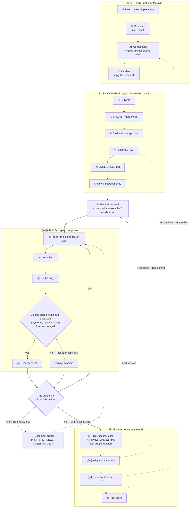

# 🎯 App Development — My Prompt Library

> ⭐⭐ **These are written to be pasted as-is.** No blanks to fill. Each one reads the session
> and the repo and works out its own context — so the same prompt works on any app, at any stage.

**How I actually work, and where each prompt lands:**

```
  THINK      ① idea → the complete app
             ② research: risk + legal
             ②b ⭐⭐ competitors — does this deserve to exist?
             ③ harden — update it to be safer

  DOCUMENT   ④ PRD          ⑤ TRD
             ⑥ design flow + app flow
             ⑦ UI/UX enhancement
             ⑧ edge cases   ⑨ how it makes money

  BUILD      ⑩ ⭐⭐ THE BUILD PLAN — this is what makes ⑪ work
             ⑪ ⭐⭐ "build the next phase of app"   ← repeat until done
             ⑫ /code-review → fix the bugs
             ⑬ security check

  SHIP       ⑭ quality enhancement
             ⑮ how it reaches real users
             ⑯ Play Store
```

---

# ⭐ Which track — pick before you start

> **Ten steps before any code is right for a real product and wrong for a weekend build.**
> Match the process to what you are actually making.

| | **FULL** | **SHORT** |
|---|---|---|
| **When** | A real product. Weeks of work. Real users' data. Going to a store. | A weekend build, a prototype, a tool for yourself, or testing an idea |
| **Think** | ① ② ②b ③ | ① + ⭐ ②b — competitors is the one research step worth keeping even on a weekend build |
| **Document** | ④ ⑤ ⑥ ⑦ ⑧ ⑨ | ④ **short** PRD + ⑤ the data model half + ⑧ edge cases |
| **Build** | ⑩ then ⑪–⑬ per phase | ⑩ then ⑪–⑫ per phase |
| **Ship** | ⑭ ⑮ ⑯ | ⑭ if anyone else will use it |
| **Sessions before code** | ≈ 9–11 | ≈ 3–4 |

```
⭐⭐ THE TWO YOU NEVER SKIP, ON EITHER TRACK:

  ⑩ THE BUILD PLAN — or your five words have nothing to read.

  ⑤'s OWNERSHIP QUESTION — "who owns this record and which field
    proves it?" Answered at design time this costs an hour. Answered
    after 40 files exist, it is a rewrite of every query you have.

⭐ EVERYTHING ELSE CAN SCALE DOWN. Those two cannot.
```

---

## ⭐⭐ Read this once — why "build the next phase of app" works

> You told me your build prompt is five words. **That is correct, and it should stay five words.**
> A long prompt every session is how context drifts and the app becomes inconsistent.

```
⭐⭐ FIVE WORDS ONLY WORK IF THE AGENT CAN FIND ITS OWN PLACE.
   That is not a prompt problem. It is a FILE problem.

  PROMPT ⑩ writes BUILD-PLAN.md — numbered phases, each with a
  definition of done and a status marker.

  ⇒ ⭐ THEN "build the next phase of app" IS SELF-LOCATING. The agent
    reads the plan, finds the first phase not marked DONE, and knows
    what it is building and when to stop.

  ⇒ ⭐⭐ WITHOUT THAT FILE, THE SAME FIVE WORDS PRODUCE A DIFFERENT
    APP EVERY SESSION — and you will not notice for three weeks.

⭐ SO: DO ⑩ ONCE, PROPERLY. It is the highest-leverage step here.
```

**Also do this once per project** — put `CLAUDE.md` at the repo root so every session reads
your rules without you pasting them:
[CLAUDE-md-template.md](CLAUDE-md-template.md)

---

# ⭐⭐ These prompts adapt — that is the point

> **A prompt that dictates the answer gets you the prompt's opinion, not the model's.**
> Every step below gives the model a **floor and a set of questions**, never a fixed answer.
> The structure is common to all apps; the answers are supposed to differ wildly.

```
⭐⭐ WHERE EACH PROMPT DELIBERATELY REFUSES TO DECIDE FOR YOU:

  DATA MODEL   ⑤ does not assume tables. Relational, document store,
               local-first, event log — it must CHOOSE and justify.
               ⭐ It names the ownership mechanism your stack uses,
                 rather than assuming one.

  SECURITY     ⑬ starts with THIS app's threat model. A notes app, a
               health tracker and a marketplace share almost nothing.
               ⭐ My eight categories are a floor; it must add yours.

  EDGE CASES   ⑧ nine categories are a starting point. A maps app, a
               camera app and a payments app fail in ways not listed.
               ⭐ The categories it ADDS are the valuable part.

  UI           ⑦ the spacing and type defaults are a sane starting
               point, and it is told to argue if your app needs
               different — density, audience, or subject.

  STACK        ⑤ is told to ARGUE AGAINST my defaults when they fit
               badly. My stack is a starting position, not a rule.

  PHASES       ⑩ has no fixed count. It cuts scope or says why it
               cannot, rather than compressing work to hit a number.
```

**Three lines you can add to any prompt here when you want more range:**

```
① "Before answering, tell me what is unusual about THIS app compared
   to a typical one — then let that change your answer."

② "Where my prompt assumes something that does not fit this app, say
   so and answer the better question instead."

③ "Give me the option I have not considered, even if you do not
   recommend it."
```

> ⭐ **And the one that matters most:** if a step's output could have been written for
> *any* app, it is wrong. Say so and run it again with more specifics.

---

# ① The idea → the complete app

⚙️ **Strongest model · `think hard`** — every later step inherits this one. A shallow answer here costs weeks.

**You have a rough idea. This turns it into a full product without you specifying it.**

```
I have an app idea. I want you to develop it into a complete product
with me — you know more about what apps need than I have written down,
so fill the gaps rather than waiting for me to specify everything.

MY IDEA:
<describe it however roughly — one line is fine>

Work through this with me:

1. WHAT I ACTUALLY MEAN
   Restate my idea as you understand it. If it is ambiguous, give me
   the two or three different products it could become and ask which
   one I mean. Do not silently pick one.

2. THE COMPLETE FEATURE SET
   Everything this app needs to actually work for a real user — not
   just what I mentioned. Group as:
   · CORE — without these it is not the product
   · EXPECTED — users will assume these exist and be annoyed if not
     (auth, search, edit, delete, settings, notifications...)
   · DIFFERENTIATING — the reason someone picks this over the
     alternative
   · LATER — real ideas, deliberately deferred

3. THE ONE CORE LOOP
   The single action a user repeats. If the app has no repeated
   action, say so plainly — that is usually a fatal problem, not a
   detail.

4. EVERY SCREEN
   The full list with one line each on what it is for.

5. WHAT I HAVE NOT THOUGHT ABOUT
   The parts of this that are harder than they look. Usually: sync,
   offline, permissions, payments, moderation, notifications, or
   someone else's API.

6. THE THREE DECISIONS I MUST MAKE NOW
   The ones that are expensive to reverse later. Give me the options
   and your recommendation, not just the question.

DO NOT ask me one question at a time — batch everything you need.
DO NOT flatter the idea. If it has a fundamental problem, lead with
that. Where you are assuming something, mark it as an assumption so
I can correct it.
```

```
⭐ THE GATE — you can say the core loop in one sentence, and the
   feature list contains things you did not think of.
```

---

# ② Research — risk and legal

⚙️ **Strongest model · `think hard` · web search ON** — regulations must be real and current, not recalled. ⭐ Competitors are the next step, ②b.

```
Research this app properly before we design it. Use what we defined in
this session as the product.

I want three things. ⭐ Competitors are ②b — do not cover them here.

1. ⭐ THE RISK REGISTER
   Everything that can go wrong with this product, not just the code:
   · TECHNICAL — what is genuinely hard to build correctly
   · DEPENDENCY — whose API or platform can kill this app by changing
     their terms, their pricing, or their rate limits
   · OPERATIONAL — what breaks when it works: support load, abuse,
     moderation, cost at scale
   · ADOPTION — why people will download it and not come back
   Rank by (likelihood × damage) and say which ones change the design.

2. ⭐⭐ THE LEGAL AND COMPLIANCE PICTURE
   Be concrete and specific to what this app actually does:
   · What personal data does it touch, and what does that trigger?
     (GDPR / DPDP / CCPA — say which apply and why)
   · Consent: what must be asked, when, and how it is recorded
   · Data retention and deletion — including the in-app account
     deletion Apple requires if users can sign up
   · Age: does this need age gating, and does it touch children's data
   · If users can post content: moderation duties, and Apple's four
     requirements — filter, report, block, contact
   · If it takes money: what the payment rules force (IAP vs Stripe),
     refunds, subscription disclosure, auto-renew terms
   · Anything sector-specific — health, finance, education, dating
     each carry their own rules and their own store scrutiny
   · Licences of anything we would depend on — AGPL is a trap

3. ⭐ WHAT WOULD GET THIS REJECTED OR PULLED
   Store rejection reasons specific to this app, ranked by likelihood.

For each finding: what it is · why it applies to THIS app · what it
forces us to do differently.

DO NOT give me a generic compliance overview. If something does not
apply, say it does not apply and why. Where a rule depends on
jurisdiction or on facts I have not given you, say what you need to
know — do not guess and do not hedge everything.

I am not a lawyer and neither are you. Mark clearly which items are
"you must get advice on this" versus "this is standard practice".
```

```
⭐⭐ THE GATE — you know the top three risks, and at least one of them
   has changed something about the product. Then go to ②b.
```

---

# ②b ⭐⭐ Competitor analysis — does this deserve to exist?

⚙️ **Strongest model · `think hard` · ⭐⭐ web search ON** — every name, price and review here must be real. This step is worthless from memory.

```
Research the competition properly. Use the product we defined in this
session. ⭐ Everything here must come from actually looking — real
names, real prices, real reviews. If you cannot verify something, say
so rather than filling the gap with something plausible.

1. WHO THEY ACTUALLY ARE — three to five of them
   For each: what it does · what it charges and on what model · roughly
   how big · how long it has existed.
   ⭐ INCLUDE THE NON-OBVIOUS COMPETITOR: the spreadsheet, the WhatsApp
   group, the notebook, or doing nothing at all. Those beat most apps,
   and they never appear on a competitor list.

2. ⭐⭐ MINE THE 3-STAR REVIEWS — the highest-signal source there is
   NOT 1-star: mostly crashes, billing, and people who wanted a
   different product.
   NOT 5-star: no information.
   ⭐⭐ THREE-STAR IS PEOPLE WHO USE IT, KEEP IT, AND ARE FRUSTRATED.
     That is your wedge, written in their own words.
   Quote the actual complaints. Group them into themes and rank them
   by how often they appear.

3. ⭐⭐ FOR EACH TOP COMPLAINT: WHY HAS IT NOT BEEN FIXED?
   The most important question on this page. They know about it. They
   did not fix it. Which is it:
   · DELIBERATE — fixing it breaks their pricing or their model
   · SEGMENT — they serve someone else, and this complainer is not
     their customer
   · HARD — genuinely difficult, and it will be just as hard for me
   · MISSED — nobody got to it. ⭐ The rarest answer, and the only one
     that is straightforwardly good news.
   ⇒ ⭐ IF YOU CANNOT TELL, SAY SO. A guess here is worse than a gap,
     because I will build on it.

4. HOW THEY GET USERS
   Their real acquisition: store search, content, paid, a partnership,
   a community, being the default somewhere.
   ⭐ For most apps distribution decides the outcome more than the
   product does. If they all use the same channel, say so — that is
   either where the users are, or a blind spot I can use.

5. ⭐ WHO TRIED THIS AND DIED
   Abandoned apps, dead startups, projects that stopped updating, and
   the visible reason.
   ⇒ ⭐⭐ A GRAVEYARD TEACHES MORE THAN A LEADERBOARD.

6. ⭐⭐ THE PARITY TRAP
   What will users expect on day one JUST BECAUSE every competitor has
   it? List them — then tell me which I can refuse to build and still
   survive.
   ⭐ This is the difference between a v1 that ships and one that never
   does.

7. THE HONEST VERDICT
   Is there a real gap here, or does it only look like one from the
   outside? Say which.
   ⭐ If this space is well served and my angle is thin, LEAD WITH THAT.

DO NOT give me a feature comparison table. I do not need to know who
has dark mode. I need to know what people are unhappy about, why
nobody has fixed it, and whether I actually can.
```

```
⭐⭐ THE GATE — you can name ONE complaint that appears across multiple
   competitors, and say why it has not been fixed.
   ⇒ That sentence is your product's reason to exist.
     If you cannot write it, you do not have one yet.
```

---

# ③ Harden — update it to be safer

⚙️ **Strongest model · `think hard`** — this is judgement about trade-offs, which is exactly where reasoning depth pays.

**The step that closes the loop.** Research is worthless if the design does not change.

```
Take everything from the research and update the product design so the
risks are actually handled. Do not summarise the research again — CHANGE
the design and show me the diff in decisions.

Go through:

1. WHAT CHANGES IN THE FEATURE SET
   Which features get modified, restricted, delayed, or dropped because
   of a risk or a legal finding. For each: what it was, what it is now,
   and which finding forced it.

2. WHAT WE MUST NOW BUILD THAT WE HAD NOT PLANNED
   Consent screens, an account-deletion flow, a data-export path,
   moderation tooling, an age gate, an audit trail, a "report" button.
   These are features. They take time. Add them to the list properly
   rather than leaving them implied.

3. THE DATA MINIMISATION PASS
   Go field by field through what we planned to collect and ask: do we
   actually need this? What we do not store cannot leak, cannot be
   subpoenaed, and does not appear on a privacy form. Cut what we can.

4. WHERE EACH RULE IS ENFORCED
   For every rule that matters — say explicitly whether it is enforced
   on the DEVICE or on the SERVER. Anything a user could tamper with
   belongs on the server, and if we have put it on the device, move it
   and say so.

5. THE THINGS WE ARE ACCEPTING
   Risks we are choosing to live with for v1. Name them. An accepted
   risk that is written down is a decision; one that is not is an
   accident waiting to be discovered.

DO NOT weaken the product to eliminate every risk. Tell me where the
safe option costs too much and the honest trade is to accept it.
```

```
⭐ THE GATE — the feature list is different from the one in step ①.
   If nothing changed, the research was not applied.
```

---

# ④ PRD — the product document

⚙️ **Strongest model · standard** — mostly writing down decisions already made. Depth matters less than completeness.

```
Write PRD.md from everything in this session.

This is the permanent product reference. Every future session reads it
before touching code, so it must stand completely alone — assume the
reader has no memory of this conversation.

1. WHAT THIS IS — three sentences. Someone reading only this knows what
   the app does and who it is for.
2. THE USER — who they are, the moment of need, what they do today
   instead.
3. THE CORE LOOP — the repeated action, step by step, as the user
   experiences it.
4. FEATURES — each with: what it does · what "done" means · what it
   explicitly does NOT do.
5. NOT IN V1 — with the reason each one waits.
6. SCREENS — each one's purpose, and what it shows with no data.
7. ⭐⭐ THE RULES OF THE DOMAIN — the business logic that is not
   obvious. What is the maximum · what happens on a conflict · who can
   see what · what is irreversible · what must never happen twice.
   This section prevents more rework than all the others combined.
8. COMPLIANCE REQUIREMENTS — from step ②, as product requirements
   rather than legal notes.
9. VOCABULARY — the exact words this app uses, and the words it must
   never use. Pick one and never drift.
10. OPEN QUESTIONS — what is genuinely undecided. Do not paper over
    these with a guess.

DO NOT include implementation, frameworks, or code. This is what and
why, never how.
```

```
⭐⭐ THE GATE — paste PRD.md into a brand-new chat with nothing else and
   ask "what is this app and who is it for?" If the answer is right, it
   works. Fix it now, not after 40 files exist.
```

---

# ⑤ TRD — the technical document

⚙️ **Strongest model · `ultrathink` · ⭐⭐ PLAN MODE** — the most expensive step to get wrong. Everything is built on it.

```
Write TRD.md — how we build what PRD.md describes. Read the PRD first
and trace every technical choice back to a product requirement.

1. THE STACK — each choice with the reason, and what it costs at 1,000
   users. Argue against my defaults if this app is a bad fit for them.
2. ⭐ THE SHAPE — what runs on the device, what runs on the server, and
   what the device must NEVER decide: prices, limits, permissions,
   anything a user could tamper with.
3. THE DATA MODEL — ⭐ CHOOSE THE SHAPE, THEN JUSTIFY IT
   Relational is my default, but if a document store, a local-first
   database, an event log or something else genuinely fits this
   product better, design THAT and tell me why. Do not force this app
   into tables because tables are what I usually use.

   Whatever shape you choose, every one of these must be answered:
   · every entity with its fields, types, and what may be empty
   · ⭐⭐ OWNERSHIP: for each entity, who owns this record and which
     field proves it? Anything you cannot answer is a leak waiting to
     happen — flag it rather than guessing.
   · ⭐ HOW OWNERSHIP IS ENFORCED IN THIS PARTICULAR STORE — row-level
     security, database rules, API middleware, whatever this stack
     actually uses. Name the mechanism and write the rules NOW.
   · what happens on delete, for every relationship
   · exact types for anything a human counts — money and time must
     never be floats or naive strings. Say what this stack uses.
   · the queries this app will actually run, and what makes each fast
   · ⭐ a STABLE sort for every paginated list — a sort key with ties
     and no tiebreaker duplicates rows across pages
4. THE API — every endpoint with method, path, auth requirement,
   request shape and response shape. Explicit shapes, never whole rows.
5. ⭐⭐ THE OLD-BUILD RULE — this API must serve an app build from eight
   months ago that is still installed and still calling. Every change
   is additive or a migration. Say how versioning works here.
6. STATE — server state, local UI state, persisted device state (and
   where: secure store vs MMKV), and derived state that should NOT be
   stored at all.
7. THIRD PARTIES — each with: why · cost · what happens when it is
   down · ⭐ and whether it needs NATIVE code, because that ends OTA
   updates for that change.
8. ⭐ THE FIVE DECISIONS THAT ARE EXPENSIVE TO REVERSE — named, with
   what each one forecloses.
9. WHAT BREAKS AT 10x — the specific first thing, not "we'll scale
   later".

DO NOT produce a generic best-practice architecture. Every choice traces
to the PRD. Where you are guessing, say so. Where two options are close,
give me the tiebreaker instead of pretending one is obvious.
```

```
⭐ THE GATE — every entity has an owner you can name, and the rule
   enforcing it is WRITTEN, in whatever mechanism this stack uses,
   before any code exists.
```

---

# ⑥ Design flow + app flow

⚙️ **Strongest model · `think hard`** — finding where a flow breaks is a search problem; give it room.

```
Map how this app actually works as an experience. Two different maps —
do both, they catch different problems.

PART 1 — THE APP FLOW (structure)
· The full navigation tree, every screen
· Which screens require auth, and what an unauthenticated user hitting
  one does
· ⭐ Deep links: what happens on a COLD START into a protected screen
  when the token is expired
· Where a push notification lands, including when the app is already
  open on a different screen
· What "back" does from every screen — including the first one
· Modal vs push vs tab, and why

PART 2 — THE USER FLOW (experience)
For each of the three most important journeys — starting with first-ever
open — walk it step by step as the user experiences it:
· what they see · what they must decide · what could confuse them ·
  where they could fail · what happens when they do
· ⭐⭐ Count the taps from app-open to the core action being completed.
  Fewer is usually better — if it is more than about three, say what
  to cut, or explain why this app genuinely needs them.

THEN TELL ME:
· Which screen is doing too much and should be two
· Which two screens are so similar they should be one
· ⭐ Where the user is asked for something before they understand why —
  this is where people quit
· Any dead end: a screen with no forward action and no clear way back
· ⭐ Where a permission is requested, and whether that is the moment
  the user understands why we need it

DO NOT draw the happy path only. The interesting parts of a flow are
where it breaks.
```

```
⭐ THE GATE — first-open to core action is three taps or fewer, or you
   know exactly why it cannot be.
```

---

# ⑦ UI/UX enhancement

⚙️ **Strongest model · `think`** · ⭐ attach real screenshots if you can — it cannot critique what it cannot see.

```
Raise the quality of this app's interface. Assume the current design is
functional but generic — my goal is that it does not look like it was
generated.

1. ⭐⭐ THE GENERIC-DESIGN AUDIT
   Find every instance of these and replace them:
   · a purple-to-blue gradient anywhere
   · glassmorphism / frosted cards
   · three feature cards with emoji icons
   · everything centred in one column
   · copy like "Empower your workflow" or "Seamlessly integrate"
   · bold weight used everywhere instead of real hierarchy
   · six shades of one brand colour
   · animation on everything
   These are not ugly. They are ANONYMOUS — they read as "nobody
   decided anything", and users feel it even if they cannot name it.

2. THE FOUNDATION — fix these before anything cosmetic
   ⭐ The numbers below are a sane default, not a law. If this app's
   density, audience or subject calls for something different — a
   data-heavy tool, a kids' app, a game, something playful — say so
   and propose the scale that actually fits.
   · ONE spacing scale, nothing outside it. Inconsistent padding is
     the thing nobody consciously notices and everybody feels.
   · A small set of type sizes and two weights. Real hierarchy.
   · Colours named by ROLE not value. One accent, on the primary
     action only.
   · Max line length 65–75 characters
   · Consistent radius and border weight

3. ⭐ THE EIGHT THAT NEED NO TASTE
   whitespace (double what feels right) · alignment · contrast · one
   accent · line length · consistent radius · visible focus and pressed
   states · hover/active/disabled on everything interactive.
   A control with no pressed state feels broken on a phone even when
   it works perfectly.

4. MOBILE FEEL — the things that separate an app from a website
   · Momentum and overscroll behave natively
   · Transitions match the platform — do not force iOS onto Android
   · Haptics on meaningful actions only, never on everything
   · Keyboard handling: the input stays visible, the layout does not jump
   · ⭐ Optimistic UI where it is safe — the tap responds instantly
   · One deliberate motion moment in the whole app, not motion
     everywhere. Motion everywhere reads as a template.

5. ⭐⭐ THE FIVE STATES, EVERY SCREEN
   loading (a skeleton shaped like the content) · error (what happened,
   what to do, retry — and NEVER clear the form) · empty (two states:
   never-had-any vs filtered-to-zero) · offline · success (visible
   confirmation — silence reads as failure and people tap twice)

6. ACCESSIBILITY — nearly free, and it is also polish
   · Tap targets ≥ 44pt/48dp, not touching
   · ⭐⭐ Text scales with the system font setting WITHOUT CLIPPING —
     this breaks most layouts and nobody tests it
   · Every icon-only control has a label
   · Colour is never the only signal
   · Reduce-motion respected

Give me the changes ranked by visible impact per unit of effort. Start
with the ones that change how the whole app feels, not one screen.
```

```
⭐ THE GATE — screenshot the main screen. If it has the same shape as a
   stock template, nothing has been designed yet.
```

---

# ⑧ Edge cases

⚙️ **Strongest model · `ultrathink`** — pure enumeration under pressure. This is the step where extra thinking pays most visibly.

**The step that prevents the rewrite.** Do it before building, not after the bug reports.

```
Produce EDGE-CASES.md — everything that can go wrong with THIS app.
For each: the trigger · what happens if unhandled · what SHOULD happen ·
where the fix belongs (client, server, or both).

Work every category deliberately. Do not skip one for being unlikely —
the unlikely ones are the ones that ship.

1. EMPTY AND FIRST RUN
   First launch, no data, no permissions · an empty list vs a list
   filtered to zero (two different screens, two different actions) ·
   search with no results · an item deleted while open elsewhere

2. NETWORK — the mobile-specific ones
   Offline before a request · offline DURING a request · a captive
   portal that resolves DNS and blocks everything · a request that
   HANGS for 60 seconds instead of failing · a response arriving after
   the user navigated away · the same write sent twice because the
   first looked stuck

3. LIFECYCLE
   The OS kills the app mid-form, mid-upload, mid-payment ·
   backgrounded an hour then reopened with stale data and an expired
   token · a deep link from cold start · a push tapped while already
   open elsewhere

4. AUTH
   Token expires mid-session · mid-request · the refresh itself fails ·
   logged out on another device · account deleted while the app is
   open · still logged in but no longer permitted on this screen

5. DATA AND CONCURRENCY
   Two devices editing one row · a queued offline write that conflicts
   on sync · a row deleted while being edited · a list changing under
   pagination · zero, negative, enormous, and exactly-at-the-boundary

6. INPUT
   Empty · whitespace only · 10,000 characters · emoji · right-to-left
   text · an apostrophe in a name · pasted formatted text · a file that
   is not what its extension claims

7. DEVICE
   Storage full · largest system font · smallest screen · rotation
   mid-action · a permission denied permanently · low-power mode ·
   a genuinely slow Android

8. MONEY, if this app takes any
   Double tap on pay · network drops after the charge but before
   confirmation · a webhook delivered twice · a webhook never
   delivered · a refund · a subscription lapsing while offline

9. ABUSE — from step ②
   Someone using this app the way you did not intend: spam, scraping,
   harassment, someone uploading something illegal.

⭐⭐ THESE NINE ARE A FLOOR, NOT A CHECKLIST TO COMPLETE.
   A maps app, a chat app, a camera app, an offline-first app and a
   payments app each fail in ways that are not on this list. Add every
   category THIS app needs that I have not written down — that is the
   most valuable part of your answer, not the nine I gave you.

Rank everything by (likelihood × damage) and tell me which must be
handled before v1 versus which can wait.

DO NOT give me generic error-handling advice. Every item must name the
actual screen or endpoint in THIS app.
```

```
⭐⭐ THE GATE — the top ten are in the build plan, not on a "later" list.
```

---

# ⑨ How it makes money

⚙️ **Strongest model · `think hard` · web search ON** — real prices and real commission rates, not remembered ones.

```
Now that we know what this app is, who it serves, and what it costs to
run — work out the business model. Be commercial and be honest.

1. WHAT IT COSTS ME TO RUN
   Per user per month, at 100 / 1,000 / 10,000 users. Include hosting,
   database, storage, push, email/SMS, any AI inference, and the store's
   cut. ⭐ Tell me the point at which a free user becomes genuinely
   expensive — that number decides the model.

2. THE THREE MODELS THAT COULD WORK HERE
   Not every model — the three that fit THIS product and THIS user.
   For each: what is free, what is paid, the price point, and why a
   user would cross the line.
   Consider honestly: one-time purchase · subscription · freemium with
   a limit · usage-based · free with a paid tier for teams · ads
   (and what ads would do to the experience and to the privacy form).

3. ⭐⭐ THE STORE RULE — get this right before building anything
   · DIGITAL goods, subscriptions, in-app content ⇒ MUST use Apple /
     Google IAP, and they take 15–30%
   · PHYSICAL goods, real-world services ⇒ MUST NOT use IAP
   Say which this app is. Getting it backwards is an automatic
   rejection and costs a review cycle every time.
   ⭐ Then re-do the pricing WITH the commission taken out. A price that
   works at 100% does not always work at 70%.

4. THE PAYWALL DECISION
   What exactly is behind it, and at what moment does the user hit it?
   ⭐ The user must have already felt the value before they are asked.
   A paywall before value is an uninstall.

5. WHAT THE FREE TIER COSTS ME
   If free users cost real money, what stops abuse? A limit that is
   generous to a human and hostile to a script.

6. THE HONEST ASSESSMENT
   Would a real person pay this? What would they compare the price to?
   ⭐ And is this a business or a project? Both are fine — but I want to
   know which one I am building before I price it like the other.

DO NOT give me a generic monetisation menu. Recommend one, with the
reason, and tell me what would make you change your mind.
```

```
⭐ THE GATE — you know which payment rail is legal for this app, and
   the price is set AFTER the store's cut.
```

---

# ⑩ ⭐⭐ The build plan — the one that makes ⑪ work

⚙️ **Strongest model · `ultrathink` · ⭐⭐ PLAN MODE** — sequencing is the whole value. Do this once, properly.

> **Do this once, properly.** It is the file that turns five words into a working session.

```
Write BUILD-PLAN.md — the phase-by-phase plan for building this app.
Read PRD.md, TRD.md and EDGE-CASES.md first.

This file exists so that in a future session I can say only "build the
next phase of app" and you will know exactly what to do. Write it for
that purpose.

RULES FOR THE PHASES:
· Each phase is one sitting of work and ends with something I can SEE
  or USE. Never "set up the data layer" with nothing to look at.
· ⭐⭐ PHASE 1 IS A VERTICAL SLICE: one real feature, screen through API
  through database, deployed and working. It proves the architecture
  before we build twenty screens on top of a wrong assumption.
· Each phase lists which edge cases from EDGE-CASES.md it must handle.
  Edge cases are built WITH the feature, never bolted on afterwards.
· Dependencies are explicit — if phase 7 needs phase 4, say so.
· Anything touching auth, payments or user data is flagged as needing
  plan mode before code.

FORMAT — use exactly this, because I will be reading the status marker:

## Phase N — <name>
STATUS: NOT STARTED | IN PROGRESS | DONE
GOAL: <what works when this is finished, in one line>
BUILD: <the concrete list of what to create or change>
EDGE CASES: <the specific ones from EDGE-CASES.md this phase owns>
DONE WHEN: <a test I can actually perform on a device>
DEPENDS ON: <phases, or none>
PLAN MODE: <yes/no, and why>

Order the phases so that the app is USABLE as early as possible and
stays usable after every phase. I would rather have a working app with
four features than a broken one with twelve.

At the end, add a section called CURRENT STATE that says what is built
so far and what is next. ⭐ You will update this section at the end of
every phase — that is how the next session knows where it is.

⭐ IF V1 GENUINELY NEEDS MORE THAN ABOUT 12 PHASES, say so and tell me
what to cut — but if cutting would break the product, say THAT instead.
Do not compress real work into fewer phases to hit a number.
```

```
⭐⭐ THE GATE — every phase ends in something you can see on a device,
   and phase 1 is a full vertical slice.
```

---

# ⑪ ⭐⭐ Build the next phase — the one you repeat

⚙️ **Strongest model · standard** — escalate to `think hard` + plan mode whenever the phase is flagged PLAN MODE.

**This is the five-word version you actually type.** It works because of ⑩.

```
Build the next phase of app.
```

**⭐ Paste this longer version once, in your first build session** — after that the short one
is enough, because `CLAUDE.md` and `BUILD-PLAN.md` carry the rules:

```
Build the next phase of the app.

BEFORE YOU WRITE ANY CODE:
1. Read BUILD-PLAN.md. Find the first phase not marked DONE.
2. Tell me which phase you are building, its goal, and its DONE WHEN.
3. Read the edge cases that phase owns, and PRD.md section 7 for any
   domain rule that constrains it.
4. If the phase is flagged PLAN MODE, plan it and STOP for my approval.
5. If anything in the plan is now wrong or out of date, say so before
   building rather than building the wrong thing correctly.

WHILE BUILDING:
· Stay inside this phase. Do not build ahead. Do not refactor things I
  did not ask about.
· Every screen ships all five states: loading, error, empty (both
  kinds), offline, success. Not one of them is optional.
· Every query filters by the authenticated user, server-side.
· Every listener and subscription is cleaned up on unmount.
· Name any dependency you add and why — and say if it needs NATIVE
  code, because that ends OTA updates for that change.

WHEN THE PHASE IS DONE:
1. Update BUILD-PLAN.md: mark the phase DONE and rewrite CURRENT STATE.
2. Tell me: what changed · what to look at first · what worried you.
3. Tell me honestly whether you ran it on a real device or only the
   simulator. Say "simulator only" if that is what happened.
4. Tell me what the next phase is, and stop.

DO NOT claim it works if you have not run it. DO NOT mark a phase DONE
because the code exists — mark it DONE when its DONE WHEN test passes.
```

```
⭐⭐ THE LOOP, PER PHASE:

   ⑪ five words → /code-review → ⑫ fix → [⑬?] → back to ⑪

  ⭐ /code-review AND ⑫ RUN EVERY PHASE. They are cheap, and a bug
    found in the phase that created it costs minutes — the same bug
    found at ⑯ costs a store review cycle.

  ⭐⭐ ⑬ IS **NOT** EVERY PHASE. Run the full security check when the
    phase touched: auth · user data · payments · uploads · deep links ·
    local storage. If the phase only changed layout or copy,
    /code-review is enough.
    ⇒ ⭐ AND ALWAYS RUN THE FULL ⑬ ONCE BEFORE YOU SHIP, whatever the
      last phase happened to touch.
```

---

## ⭐ Every third phase — the document check

> **Documents rot, and a stale document is followed confidently.** That is worse than no document:
> the agent builds to an outdated spec, and it looks like it obeyed you.

```
Before the next phase, check the documents against what we have built.

Re-read PRD.md, TRD.md and EDGE-CASES.md and tell me:

1. WHAT WE BUILT THAT CONTRADICTS THEM
   Where does the code now disagree with the document? For each, say
   which one is right — sometimes the code learned something and the
   document should change; sometimes we drifted and the code is wrong.

2. WHAT WE DECIDED BUT NEVER WROTE DOWN
   Decisions made in a build session that live nowhere. These are the
   ones that get silently reversed three phases later.

3. WHAT IS NOW WRONG OR DEAD
   Sections describing something we cut, renamed, or replaced.

4. ⭐ WHAT WE HAVE LEARNED THAT CHANGES THE PLAN
   Anything that should reorder, add, or remove a phase in BUILD-PLAN.md.

Then update the documents. Show me the diff in decisions, not a
rewritten file.

⭐ If everything still matches, say so plainly and we move on — do not
invent changes to look thorough.
```

---

# ⑫ Fix the bugs — after `/code-review`

⚙️ **Strongest model · `think`** — escalate to `think hard` if a bug keeps returning; that means the cause was never found.

**Run `/code-review` first.** Then paste this with the findings.

```
Fix these review findings.

For each one, before you change anything:
· Tell me whether you agree it is a real bug. ⭐ If you think a finding
  is wrong, say so and explain why — do not "fix" something that is
  not broken just because a review flagged it.
· Say what the actual failure is: what input or sequence produces it,
  and what the user would see.

Then fix them, most severe first, and for each fix tell me:
· what changed
· ⭐⭐ WHY THIS CLASS OF BUG HAPPENED — if the same mistake could exist
  elsewhere in the app, say where and check those places too. One bug
  is a bug; a pattern is a design problem.
· whether a test now covers it — and if not, why not

RULES:
· ⭐ Do not delete or weaken a test to make something pass. If a test
  is wrong, say the test is wrong and explain.
· Do not fix a symptom when you can see the cause.
· Do not refactor beyond the fix. A large diff hides the change I need
  to review.
· If a fix reveals a design problem too big for a patch, STOP and tell
  me rather than building a workaround I will inherit.

At the end: what is still broken that we are choosing to live with,
and is it written down anywhere?
```

```
⭐ THE GATE — you know why each bug happened, not just that it is gone.
```

---

# ⑬ ⭐⭐ Security check

⚙️ **Strongest model · `ultrathink`** · ⭐⭐ then the cross-check in a **different model** — same model, same blind spot.

```
Do a security audit of everything built so far. Be adversarial. Assume
the attacker has the APK, can proxy the traffic, and has a valid account
of their own.

⭐⭐ START WITH THE THREAT MODEL FOR **THIS** APP, NOT MY LIST.
   Before working through anything below, tell me: what is genuinely
   at stake here, who would attack it, and what would they want?
   A local-only notes app, a health tracker, a marketplace, a kids'
   app and a fintech app have completely different answers — and the
   categories below are a FLOOR, not the whole job.
   ⇒ ⭐ ADD EVERY CATEGORY THIS APP NEEDS THAT I HAVE NOT LISTED, and
     say plainly which of mine do not apply here and why.

Then work these:

1. ⭐⭐ AUTHORIZATION — the one that actually leaks
   For every endpoint: can a logged-in user reach another user's data
   by changing an ID? Check LIST and SEARCH endpoints too — those are
   the ones people forget to scope.
   Is authorization in the QUERY, or after loading the row? After
   loading is still a leak if the row is returned on any path.

2. THE BUNDLE — assume every string in it is public forever
   What secrets are in the build? Publishable keys are fine; anything
   else is not. Tell me exactly what to grep for.

3. LOCAL STORAGE
   What is written to disk and where? ⭐ Anything personal in
   AsyncStorage is plain text on the device. Does the query cache
   persist user data? Does logout clear ALL of it — secure store,
   cache, files, downloaded images?

4. TRANSPORT
   HTTPS everywhere, no cleartext exception in the Android config.
   Anything sensitive in a URL — those land in server logs and analytics.

5. INPUT AND DEEP LINKS
   Every input validated server-side. No request body spread into a
   database call. ⭐⭐ Deep links are untrusted input from ANY app or
   website — is every parameter validated, and can a deep link perform
   an action without confirmation?

6. UPLOADS
   Content validated, size capped, ⭐ EXIF stripped — photos carry GPS.

7. PRIVACY — what leaves the device
   Crash reports and analytics are a data store you never designed and
   usually the least protected thing you own. Is PII scrubbed before
   send? Does the store privacy form match what the SDKs actually
   collect without being asked?

8. ABUSE AND COST
   What can someone automate against this? Where is rate limiting?
   ⭐ What is the most expensive thing an attacker can make me pay for?

For each finding: the concrete attack, the file and line, and the fix.
Rank by real exploitability, not theoretical severity.

⭐ If you find nothing in a category, say so explicitly. Do not invent
findings to look thorough.
```

**⭐⭐ Then the cross-check — paste this into a DIFFERENT model:**

```
Here is a diff. Find bugs. Check specifically:
 ① Can a logged-in user reach another user's data by changing an ID?
 ② Can this loop, retry, or fire more than once? What does it cost?
 ③ What happens if the network drops HALFWAY THROUGH this?
 ④ What happens if the OS kills the app right here?
 ⑤ What input breaks it — empty, null, huge, wrong type, unicode?
 ⑥ Is anything secret being written to storage or logs?
List concrete failures with line numbers. Do not summarise the code.
If you find nothing, say so — do not invent findings.
```

```
⭐⭐ THE GATE — three things done BY HAND, not claimed:
   ① unzip your own build and grep it for secrets
   ② the ID-swap test THROUGH A PROXY, as two real accounts
   ③ log out, then confirm nothing personal survives on disk

⭐ Also run the scans — your API is a website:
   ssllabs.com/ssltest ⇒ A · securityheaders.com ⇒ A
   A grade is a floor, not a certificate. Neither tests whether user A
   can read user B's data. That is ①.
```

---

# ⑭ Quality enhancement

⚙️ **Strongest model · `think hard`** · ⭐ attach screenshots and real measurements, or you get guesses.

```
Assess this app's quality honestly, as if deciding whether to recommend
it to someone. I want the real assessment, not encouragement.

1. WOULD A REAL USER FINISH THE CORE LOOP?
   Walk it as a first-time user who has read nothing. Where would they
   hesitate, guess, or give up? Name the exact screen.

2. WHAT LOOKS UNFINISHED
   Placeholder text, inconsistent spacing, a screen that does not match
   the others, an error message written for a developer, a control with
   no pressed state, an icon that means nothing.

3. THE FIVE-STATE AUDIT
   Every screen and list: loading, error, empty (both kinds), offline,
   success. Which are missing? ⭐ Missing states are the single most
   common reason an app feels unfinished.

4. PERFORMANCE, MEASURED NOT GUESSED
   Cold start time · scroll on a LOW-END ANDROID, not an iPhone · any
   list not virtualised · any full-resolution image in a list · app
   size, because every MB costs installs on a slow connection.

5. ⭐ WHAT WOULD GET A ONE-STAR REVIEW
   Ranked. Battery drain, data usage, lost work, a spinner that never
   ends, and "it deleted my thing" are the usual winners.

6. THE ROBUSTNESS PASS
   Rotate · background for ten minutes and return · force-kill
   mid-action · airplane mode · a throttled lossy connection (worse
   than offline, because requests HANG instead of failing) · deny every
   permission · largest system font · storage full.
   Which of these have actually been tested, and which are assumed?

7. WHAT IS ACTUALLY GOOD
   Say this too — I need to know what to protect during refactors.

8. ⭐⭐ THE VERDICT
   Is this ready for strangers? Not "with some polish" — yes or no, and
   if no, the specific list standing in the way, ordered.

DO NOT be encouraging. Do not tell me it looks great. If the answer to
8 is no, lead with that.
```

```
⭐ THE GATE — you have run it on a cheap Android, not just a simulator.
   Jank, memory pressure and slow networks show up there first.
```

---

# ⑮ How it reaches real users

⚙️ **Strongest model · `think hard` · web search ON** — the communities it names must actually exist.

```
The app works. Now tell me honestly how anyone finds out it exists.

0. ⭐ RE-CHECK THE COMPETITORS BEFORE ANYTHING ELSE
   My ②b research is months old now. What has changed — new entrants,
   price changes, a competitor who shipped the thing I built around?
   ⇒ ⭐⭐ IF SOMEONE CLOSED MY GAP WHILE I WAS BUILDING, I need to know
     now, not after I have written a store listing claiming it.

1. ⭐⭐ WHERE MY USERS ALREADY ARE
   Not "social media". The specific places the person from the PRD
   already spends time — subreddits, forums, Discords, WhatsApp
   groups, YouTube channels, local communities, a professional body.
   Name them.

2. THE FIRST 100
   How I get the first hundred users WITHOUT a budget. These come from
   places that do not scale, and that is fine — that is what the first
   hundred always are. Be concrete: what do I post, where, and what
   does it say?

3. ⭐ APP STORE OPTIMISATION — this is free traffic and most people
   ignore it
   · The title and subtitle, written for what a person would actually
     SEARCH, not for what we call it internally
   · The keyword set
   · ⭐⭐ The first screenshot — it is seen more than everything else
     combined and it must show the VALUE, not a login screen
   · The first three lines of the description, because that is all
     anyone reads
   Write these for this app. Give me real text, not advice about text.

4. THE FIRST-OPEN PROBLEM
   ⭐ Most people who install never come back after day one. What
   happens in the first 60 seconds, and where exactly do they drop?
   What is the smallest change that gets them to the core loop faster?

5. WHAT MAKES SOMEONE TELL SOMEONE ELSE
   The honest answer, or "nothing yet" if that is true — and then what
   would have to change.

6. WHAT I SHOULD MEASURE
   Five numbers, not fifty. ⭐ Whatever tells me whether people come
   BACK, because retention is the only number that means anything
   early. And say what each number should look like for this to be
   working.

7. WHAT NOT TO BOTHER WITH YET
   The marketing activity that feels productive and does nothing at
   this stage.

DO NOT give me a generic growth playbook. Everything must be specific
to this app and this user, and something I could do this week.
```

```
⭐ THE GATE — you can name three specific places your user already is,
   and what you would post in each.
```

---

# ⑯ Play Store — and the App Store

⚙️ **Any capable model · standard** — this is checklist work. Spend the effort budget on ⑬ instead.

```
Prepare this app for store submission. Walk the full checklist and tell
me what is NOT done. Do not tell me what is done.

CONTENT
· No placeholder text anywhere. Grep for: lorem, TODO, "Feature One",
  example.com, John Doe, test@test.
· Real copy, spell-checked. Every image and icon has a label.

LAYOUT — on the SMALLEST supported device
· No horizontal overflow · safe areas respected · nothing behind the
  keyboard · tap targets ≥ 44pt/48dp · ⭐ tested at the LARGEST system
  font size without clipping · landscape works or is deliberately locked

STATES — every screen
· Offline · empty (both kinds) · error with retry · success feedback ·
  skeletons not bare spinners

⭐⭐ PAYMENTS — the #1 rejection, and it is binary
· DIGITAL goods or subscriptions ⇒ MUST use Apple/Google IAP
· PHYSICAL goods or real-world services ⇒ MUST NOT use IAP
· Receipts validated SERVER-SIDE. Restore purchases works.
Confirm which category this app is and that the implementation matches.

LEGAL — from step ②, now as submission requirements
· Privacy policy live, reachable, and linked IN-APP — ⭐ a 404 is a
  rejection
· Terms / EULA
· ⭐ In-app account deletion that actually reaches every system —
  required by Apple if users can create an account
· If users can post anything: filter, report, block, and contact info.
  Apple requires all four.
· ⭐⭐ The data-safety / privacy-nutrition form matches what the app
  ACTUALLY collects — including what the SDKs collect without asking
· Permission usage strings explain WHY in plain language.
  "This app needs camera access" is a rejection.
  "To scan the barcode on your receipt" is not.

PLAY STORE SPECIFICS
· Target API level meets the current requirement
· App signing configured, and the upload key is backed up somewhere
  I will still have in two years
· ⭐ Run the PRE-LAUNCH REPORT — free, real devices, and usually
  ignored. Read the crashes AND the accessibility warnings.
· Data safety form · content rating questionnaire · the store listing
  from step ⑮

OPERATIONS — the part that matters after launch
· Sentry with native symbolication, and ⭐ a REAL crash triggered once
  to confirm symbolication works. Otherwise you find out during the
  incident.
· ⭐⭐ A STAGED ROLLOUT. Never 100% on day one.
· ⭐⭐ A FORCE-UPDATE MECHANISM — the only kill switch you have on the
  day a broken version is live and review takes three days.
· The OTA path tested end to end BEFORE you need it
· Tested on: oldest supported iOS · oldest supported Android · one
  cheap Android · one small screen · one large screen

For each item: done, not done, or not applicable — with a reason.
⭐ Do not mark anything done that you have not actually verified.
```

```
⭐⭐ THE GATE — before you submit:
   ① a staged rollout is configured
   ② force-update works and you have tested it
   ③ a real crash appeared in Sentry, symbolicated
   ④ the demo account for review exists and works
```

---

# ⭐⭐ The order — and how to run it



---

## ⭐ What this actually looks like, session by session

| Session | You paste | You get |
|---|---|---|
| **1** | ① | The full feature set, including things you had not thought of |
| **2** | ② | Risks and legal — with web search on |
| **3** | ⭐⭐ ②b | Competitors, their 3-star complaints, and why nobody fixed them |
| **4** | ③ | A **changed** feature list. If nothing changed, redo ②/②b |
| **5** | ④ | `PRD.md` |
| **6** | ⑤ · ⭐ plan mode | `TRD.md` + the data model |
| **7** | ⑥ then ⑦ | Flows, then UI direction |
| **8** | ⑧ | `EDGE-CASES.md` |
| **9** | ⑨ | The money model |
| **10** | ⑩ · ⭐ plan mode | `BUILD-PLAN.md` — **the file everything after depends on** |
| **11** | ⭐⭐ the **long** ⑪, once | Phase 1 built. Now copy its rules into `CLAUDE.md` |
| **12** | `/code-review` → ⑫ | Bugs fixed, and why they happened |
| **13** | ⑬ *(phase 1 is a vertical slice, so yes)* | The security pass |
| **14** | **`build the next phase of app`** | Phase 2 |
| **15** | `/code-review` → ⑫ | …and repeat 14–15 per phase |
| **every 3rd** | the document check | Documents that still match reality |
| **last** | ⑬ full → ⑭ → ⑮ → ⑯ | Shipped |

```
⭐⭐ AFTER SESSION 11, YOUR TYPING IS BASICALLY:

   "build the next phase of app"
   /code-review
   <paste the findings>
   ...repeat...

  ⭐ THAT IS THE WHOLE POINT. The ten sessions before it exist so
    that those three lines are enough.
```

---

## How to run this effectively

```
⭐⭐ THE SHAPE OF IT:
   ①–⑩ you do ONCE, at the start.
   ⑪–⑬ you REPEAT, every single phase.
   ⑭–⑯ you do ONCE, at the end.

  ⇒ ⭐ MOST OF YOUR TIME IS SPENT IN THE LOOP. Everything before it
    exists to make those five words work.
```

## ⭐ Where to spend the thinking budget

| Step | Model | Effort | Why |
|---|---|---|---|
| ⑤ TRD · ⑩ Build plan | strongest | ⭐⭐ `ultrathink` **+ plan mode** | Most expensive to get wrong; everything is built on them |
| ⑧ Edge cases · ⑬ Security | strongest | ⭐⭐ `ultrathink` | Enumeration under pressure — depth converts directly into findings |
| ① ② ②b ③ ⑥ ⑨ ⑭ ⑮ | strongest | ⭐ `think hard` | Judgement and trade-offs |
| ⑦ UI · ⑫ Fix bugs | strongest | `think` | Escalate if a bug returns — that means the cause was never found |
| ④ PRD · ⑪ Build · ⑯ Store | strongest / any | standard | Writing down decisions, or checklist work |

```
⭐⭐ THE THREE MULTIPLIERS, IN ORDER OF EFFECT:

 ① ⭐⭐ PLAN MODE ON ⑤ AND ⑩. Bigger effect than any wording change.
    You review the thinking BEFORE the code exists, which is the only
    point where changing your mind is still cheap.

 ② ⭐ WEB SEARCH ON FOR ②, ②b, ⑨ AND ⑮. Competitors, regulations, prices
    and communities must be REAL and CURRENT. Recalled facts are the
    one place these prompts will quietly hand you something wrong.

 ③ ⭐ SCREENSHOTS AND MEASUREMENTS FOR ⑦ AND ⑭. A model cannot
    critique a screen it has not seen, or a load time nobody timed.
    Without them you get plausible generic advice.
```

**Eight things that decide whether this works:**

```
① ⭐⭐ SAVE THE ARTIFACTS AS REAL FILES IN THE REPO.
   PRD.md · TRD.md · EDGE-CASES.md · BUILD-PLAN.md
   ⭐ A document that lives only in a chat is gone next session. The
     whole library depends on these four existing on disk.

② ⭐ ONE PROMPT PER SESSION for steps ①–⑩.
   These are thinking steps. Chaining two of them in one session
   gives you shallow answers to both.

③ ⭐⭐ NEVER SKIP ⑩. Without BUILD-PLAN.md your five-word build
   prompt has nothing to read, and every session guesses differently.

④ ⭐ PUT CLAUDE.md AT THE REPO ROOT ONCE.
   It is read automatically every session, so your rules apply
   without pasting them. That is what keeps ⑪ at five words.

⑤ ⭐⭐ /code-review AND ⑫ EVERY PHASE — NOT ONCE AT THE END.
   A bug found in the phase that created it costs minutes.
   The same bug found at ⑯ costs a store review cycle.
   ⭐ ⑬ is the exception: only when the phase touched auth, data,
     payments, uploads, deep links or storage — plus once before ship.

⑥ ⭐ ANSWER THE GATE BEFORE MOVING ON.
   Each step ends in one. A gate you skipped is a rewrite you
   scheduled for later without noticing.

⑦ ⭐ WHEN A SESSION GETS LONG OR GOES SIDEWAYS, START A NEW ONE.
   The files carry the context now. Nothing is lost — that is the
   entire point of ④–⑩.

⑧ ⭐ PASTE ONE PROMPT, NOT THE LIBRARY.
   The agent should get the step it is on, not all sixteen.
```

**When something goes wrong mid-project:**

| What happened | Where to go |
|---|---|
| The agent built the wrong thing | ⭐ `BUILD-PLAN.md` was vague — fix the phase's **DONE WHEN**, not the prompt |
| Every session feels different | ⭐⭐ `CLAUDE.md` is missing, or `CURRENT STATE` is not being updated |
| The app works but feels cheap | ⑦, then ⑭ |
| Scope has quietly doubled | Re-read the **NOT IN V1** section of `PRD.md` |
| A bug keeps coming back | ⑫ — you fixed the symptom, not the class |
| You do not know what to build next | ⭐ Read `CURRENT STATE` at the bottom of `BUILD-PLAN.md` |

```
⭐ AND THE ONE HABIT WORTH MORE THAN ANY PROMPT HERE:
   AT THE END OF EVERY PHASE, RUN IT ON A REAL, CHEAP ANDROID.
   ⭐⭐ The simulator has no real network, no real memory pressure and
     no real GPU. It will not show you what your users will see.
```

---

# ⭐ After launch — the four you will actually reuse

| When | Prompt |
|---|---|
| **A crash in Sentry** | `Here is a stack trace and the device/OS breakdown. What is the root cause, how many users are affected, and is this OTA-fixable or does it need a store release?` |
| **A one-star review** | `Here is a review. What is the real underlying problem, which screen is it on, and is it a bug, a missing state, or a misunderstanding?` |
| **"It feels slow"** | `Profile cold start and the main list scroll on a low-end Android. Give me the top three costs in measured milliseconds, not guesses.` |
| **A new feature** | `Read PRD.md and EDGE-CASES.md. I want to add this feature. What does it break, and what does it make impossible later? Plan mode first.` |

---

**Depth on any line above:** [folder index](README.md) · **Per-project rules:**
[CLAUDE-md-template.md](CLAUDE-md-template.md) · **Security detail:** [05-Security.md](05-Security.md) ·
**The full audit:** [10-Ship-Checklist.md](10-Ship-Checklist.md) · **Legal:**
[12-Legal-and-Compliance.md](12-Legal-and-Compliance.md)
